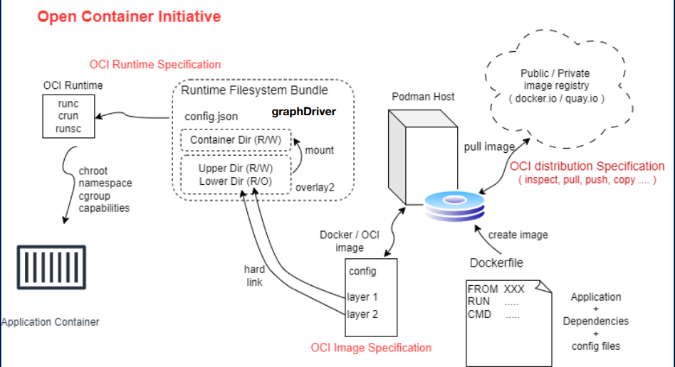
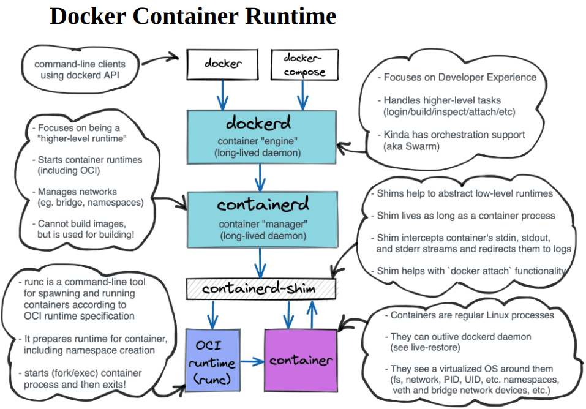
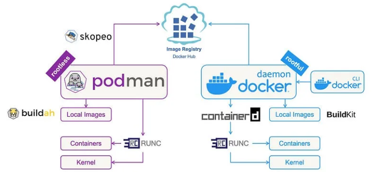
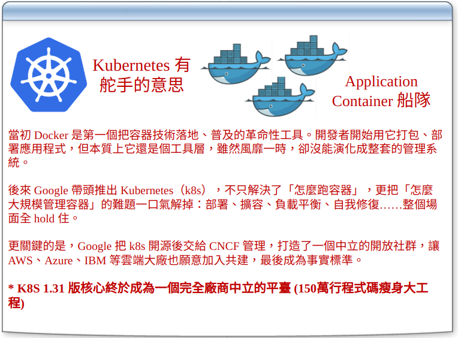
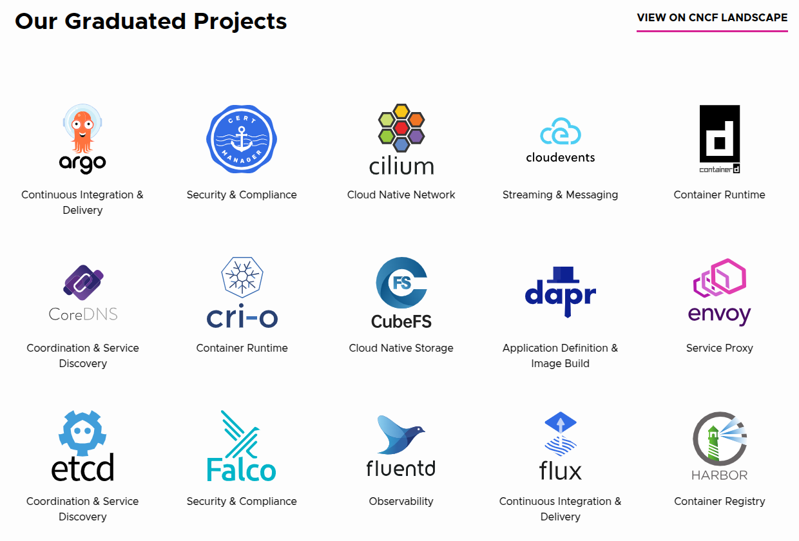
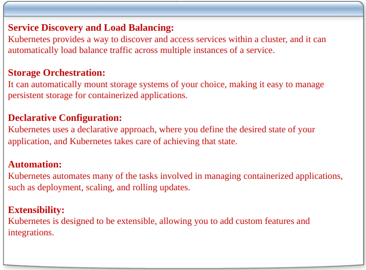
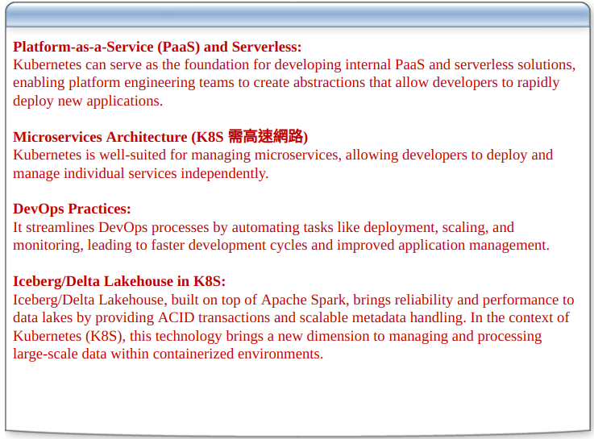
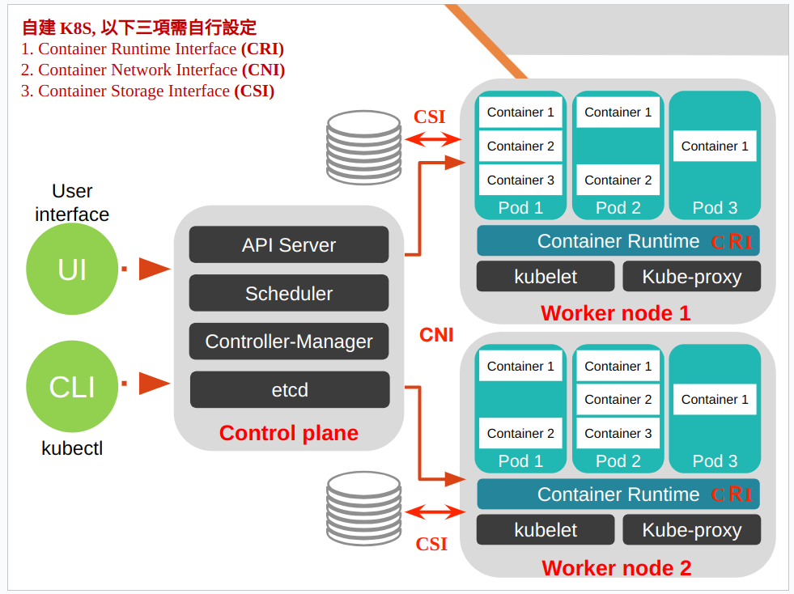

# 300-Kubernetes-Overview

- [老師講義網址](https://goo.gl/9BZvMv)
  - 投影片檔,可以開啟

- 授課老師 陳松林 [mail](oc99.98@gmail.com)

## 引言

- 交接痛苦，沒有相關文件資訊。

- 歷史除錯紀錄遺失
  - 現況git commit
  - 實際沒有特別寫文件

## Docker

- Containerization
- 降低Human Error
- App Container
- `Running Any App Anywhere`
- 文件 -> Dockerfile

### Application Container - 軟體貨櫃

- 一台電腦(虛擬電腦)
- `Linux namespace`: 提供軟體不同的`隔離`功能
  - 表示系統是在Linux底下跑
- `CGroup`: 分配硬體資源(CPU,Memory,Network)
  - Control Group
  - K8s 六顆星重點
- `Overlay2`: 由Application Container Image建立Container檔案系統
  - `Linux底下`
  - 特性:啟動電腦，檔案出現，關閉電腦，檔案消失。
    - 可用`Volume`解決問題。
- `Virtual Bridge/Slirp4netns`: 建立虛擬網路，連結Internet
- 程式App需要的相依檔案包含在Application Container內

#### WASM

- WebAssembly
- 與JVM概念一樣
- Container時代有機會成形取代Overlay2
- `課外實驗`:樹梅派單板電腦跑K3S的WASM

### 認識 Open Container Initiative

- https://opencontainers.org/
- OCI 組織
- App Container 標準化

### Application Container 生成運作圖



- OCI 三個標準
  - `Distribution`
  - `Image`
  - `Runtime`

- image內部會放 設定檔 / 壓縮檔 / extension lib

### Docker Container Runtime


- 兩個背景程式 跑在 dockerd

#### dockerd
- d: `daemon`
- Follow oci distribution
- 下載image
- 虛擬網路

#### containerd

- Follow oci Runtime
- 執行runc `oci Runtime`
- 做出Container

##### containerd-shim

- 負責拿來監控產生的Container
  - 目前執行狀況，使用資源
  - 回報給containerd
- 一對一的關係
- 如果版本號不同時，shim, containerd
  - 會對不起來，無法正常運作
  - `講師分享`：自己手刻不使用套件，可能遇到的問題

### High Level Container Runtime


- podman可以替代docker
  - rootless
- 與docker參數指令一模一樣
  - 可以考慮指令替代方式
  ```cmd=
  alias docker='sudo podman'
  ```

### 指令安裝與套件

```cmd=
# 更新linux
sudo apt update; sudo apt upgrade -y
# 安裝套件
sudo apt install zip unzip ipvsadm golang-go  -y
```

#### Podman安裝於Ubuntu24.04

- 規格版本限制4.9以上，一定要比這個還新

```cmd=
sudo apt install podman -y
sudo podman version
nano .bashrc
--------------
# 編輯加入
alias docker='sudo podman'
# 儲存離開
--------------
sudo reboot
```

#### 腳本 nano podman4.sh

```shell=
#!/bin/sh
ubuntu_version='22.04'
key_url="https://download.opensuse.org/repositories/devel:/kubic:/libcontainers:/unstable/xUbuntu_${ubuntu_version}/Release.key"
sources_url="https://download.opensuse.org/repositories/devel:/kubic:/libcontainers:/unstable/xUbuntu_${ubuntu_version}"

echo "deb $sources_url/ /" | tee /etc/apt/sources.list.d/devel:kubic:libcontainers:unstable.list
curl -fsSL $key_url | gpg --dearmor | tee /etc/apt/trusted.gpg.d/devel_kubic_libcontainers_unstable.gpg > /dev/null
```


#### 補充資訊

- k8s `ingress` 即將淘汰，要被 `gateway api` 取代
  - ingress範圍很窄，只用在http
- 回家運作方式，可以用網站上的vm跑linux照著指令逐步操作。


## Kubernates

### Docker 領風騷，Kubernetes 定天下



- Docker swarn / Docker compose 已經逐漸淘汰
- 1.31是里程碑，建議使用此版本
  
#### 補充


```
#程式碼大瘦身 #DRA #GPU
K8s 釋出1.31版，終於完成 150萬行程式碼 瘦身大工程，新增 DRA 動態資源分配能彈性調度GPU支援AI訓練

K8s 問世十年，早期許多關鍵程式碼的儲存路徑，分散在五大雲端供應源，包括Google雲、AWS、Azure、OpenStack和vScphere，也內建到許多內建元件中，因此，早在K8s第七版時，K8s專案成員就開始積極的想要將這些涉及特定廠商的路徑從K8s核心程式碼中移除，轉移到外部，來提高核心程式碼對廠商的相依性。

但這是一個涉及150萬行程式碼的超大工程，經過了24個版本（以每年四版來推算，至少花了6年），終於在1.31版（代號，轉移了最後一部分的程式碼，也為此延伸出了四大子系統，雲端控制器管理員、API伺服器網路代理、kubelet憑證供應商外掛、儲存外掛搬遷到CSI。K8s核心程式碼移除了150萬行程式碼之後，二進位檔因此大幅瘦身了40%。從1.31版開始，K8s核心終於成為一個完全廠商中立的平臺，也更容易與各種不同的雲端供應商整合。除了上述四大子系統之外，K8s雲端供應商工作小組實現這個里程碑之後，下一個目標是優化K8s對混合環境的支援，包括跨私雲和公雲的叢集運作，讓異質環境整合更簡化，另外要建立一個可以涵蓋更多雲端供應商的測試框架。

除了大瘦身之外，1.31版有一項重要的新特色是新增了 Dynamic Resource Allocaiton（動態資源分配，簡稱DRA）的API，1.31版是第一個支援這項功能的版本。可以透過 API 來請求和共享跨不同Pod叢集中的容器，而且是一個通用資源的調度工具，可以調度各種常見硬體資源，包括了GPU或是各種網路加速硬體。可以使用 DRA 來調度GPU資源，甚至快速因應不同工作負載需求來分配所用的硬體 GPU 支援，有助於因應AI模型訓練，如大型LLM訓練運算需要的算力調度，提供更多也更彈性的工作負載調度安排。
```

#### CNCF基金會

- [cncf.io](http://www.cncf.io)
  - Products裡面有列出常見的SRE工具/專案，`一定要關注`
  

```txt
CNCF 組織 (cncf.io)
在講雲原生 (Cloud Native) 之前，我們先了解一下 CNCF (Cloud Native Computing Foundation，CNCF)，即雲原生計算基金會，2015 年由谷歌牽頭成立，基金會成員目前已有一百多企業與機構，包括亞馬遜、微軟。思科等巨頭。雲原生運算基金會（的目的在於推動基於開源碼軟體的雲端原生運算，相關的專案必須同時符合 Containerization (貨櫃化)、動態調度與微服務導向等特性，迄今已接納 10 個以上專案，包含由 Google 所捐贈的 Container 調度工具 Kubernetes、貨櫃運行環境專案 containerd、貨櫃網路介面專案 CNI、監控解決方案 Prometheus、分散式追蹤專案 OpenTracing，以及統一資料蒐集與使用的 Fluentd 專案等。

CNCF 給出了雲原生應用的三大特徵：
1. Containerization 貨櫃化：以 Container 為基礎，提高整體開發水平，形成代碼和組件重用，簡化雲原生應用程式的維護。在 Container 中運行應用程式和進程，並作為應用程式部署的獨立單元，實現高水平資源隔離。
2. 動態管理：通過集中式的編排調度系統來動態的管理和調度。
3. 面向微服務：明確服務間的依賴，互相解耦。

雲原生包含了一組應用的模式，用於幫助企業快速，持續，可靠，規模化地交付業務軟體。雲原生由微服務架構，DevOps 和以 Container 為代表的敏捷基礎架構組成。
```

### 認識 Kubernetes 

#### 能力


##### Declarative Configuration

- 編輯yml檔來做app
- 知道如何建立app
- 解決交接文件

##### Automation

- 增擴容的前提，要有預留空間。

##### Extensibility

- k8s擴充能力，要用go語言實作。

#### 用途



##### PAAS

- K8s是符合Paas

##### 微服務

- 局部重啟特定服務。
- 網路快速反應。
- 有K8s技術，才讓微服務有機會實現

##### DevOps Practies

- 自動化 ex: jenkins
- 老師後面會分享如何把jenkins丟進k8s

##### Iceberg/Delta Lakehouse in K8S

- 湖倉(`數據中台`：某些政府單位or金融機構)


#### 備註

```
1. 台灣人工智慧同好交流區
https://www.facebook.com/groups/datasci.tw/posts/9133905346686774/
1. Day17 - 模型壓縮之如何玩弄模型PART2：蒸餾/剪枝/稀疏化
https://ithelp.ithome.com.tw/articles/10353396
1. [ 技術名詞介紹 ] 知識蒸餾 Knowledge Distillation
https://medium.com/@simon3458/intro-knowledge-distillation-cea0e5d6d842
1. Gen.AI Frontiers的貼文
https://www.facebook.com/61572886117067/posts/-distillm-2對比學習如何提升-llm-知識蒸餾效能-microsoft-與-kaist-ai-研究團隊提出了一種-對比學習方法contrastive-/122115664340762870/
5.【DeepSeek】R1 入門指南：架構、訓練、本地部署和硬體需求
https://hao.cnyes.com/post/133342
1. 如何利用量化在低資源情況下執行70B的LLaMA2模型？
https://r23456999.medium.com/如何利用量化在低資源情況下執行70b的llama2模型-98691acc7d81
1. 不專業整理 - A100 / RTX 6000 / 4090 價格與 LLM 效能數據
https://blog.darkthread.net/blog/gpu-4-llm-price-n-performance/
1. AI Tools for Kubernetes Management
https://medium.com/@manojkumar_41904/ai-tools-for-kubernetes-management-57d3f20d1316

數位發展部 2025 宣告
* 算力 (Computing Power):
    * 數位部與國科會提供有限的免費 GPU 算力（H100, MI300X）給學術界及民間新創，主要用於驗證初期想法 (Proof of Concept)。
    * 不大量提供是為了避免扼殺民間算力池的商業機會，維持生態系健康。
    * 會定期舉辦說明會並有申請時程。

有算力,才有機會培養人才,民間要有算力,硬體 幾千萬起跳, 國家的算力會分配到那些人手上 ?

LLM 硬體規格需求
1. One or two a6000s(NT$ 180,000) can serve a 70b with decent tps for 20 people

2. Llama-3.1-Nemotron-Ultra 支援 128K 字詞的 context length，欲執行推論，最好搭配單一 8xH100  節點

輝達（NVIDIA）前年（2022）發布「NVIDIA H100 80GB Tensor 核心GPU PCIe」大受歡迎，近日網友發現該產品在本土電商平台上架，價格高達139萬元，然而重整頁面後竟已立刻售完，網友嚇歪直呼「當你還在那嫌貴的時候，商品早已完售」

AI 與 K8S
AI Tools for Kubernetes Management 
1. Kubeflow: Kubeflow is an open-source platform dedicated to machine learning (ML) on K8s. It offers tools for building, deploying, and managing ML models within K8s clusters. Kubeflow Pipelines, for example, enables automated ML workflows, making it easier to integrate ML with your applications.
2. Kubermatic: Kubermatic Kubernetes Platform (KKP) uses AI to optimize K8s cluster management. It automates tasks like scaling, updates, and self-healing, improving cluster efficiency. Kubermatic also enhances security with built-in policies and controls.
3. Opsani: Opsani uses AI to continuously optimize K8s application performance. It analyzes metrics, configures settings, and adapts to changing workloads in real-time, ensuring optimal resource usage and cost-efficiency.
4. Spot by NetApp: Spot uses AI to manage K8s infrastructure across multiple cloud providers. It automates the selection of the most cost-effective instance types and automatically scales clusters based on workload requirements.
5. K-rail: K-rail focuses on K8s security and compliance. It uses AI to scan K8s configurations and policies, identifying vulnerabilities and violations, and providing actionable recommendations.
```

-----

## Kubernetes 原生運作架構



- K8s一定要三台電腦
  - 3個application container可以滿足
- 參考網站 [k8s kind](https://kind.sigs.k8s.io/)
  - 把k8s裝在application container。
  - `取代docker compose`
  - google eng製作。
- 參考網站 [k3d](https://k3d.io/stable/)
  - 用application container `k3S` 來做IOT。
  - 物聯網的作法可參考。
  - k3s把k8s原先5個program縮成一個，輕量化。
- 只要一台Server，裡面三個application container
  - `作業系統`
    - ubuntu linux
    - Red Hat Enterprise Linux
  - `容器工具`
    - podman

##### 補充備註

```
1. [Day7] Container Runtime - CRI-O (一定要看)
https://ithelp.ithome.com.tw/articles/10219102?sc=rss.iron
2. Docker demons: PID-1, orphans, zombies, and signals.
https://www.fpcomplete.com/blog/2016/10/docker-demons-pid1-orphans-zombies-signals
3. 微服務基礎建設 - Service Discovery (有解釋 傳統 DNS+DHCP 服務與 Discovery Service 的差異, 一定要看)
https://columns.chicken-house.net/2017/12/31/microservice9-servicediscovery/

Kubernetes Masters
本節將說明如何部署與設定 Kubernetes Master 角色中的各元件，在開始前先簡單了解一下各元件功能：

kubelet：負責管理 POD 的生命週期，定期從 API Server 取得節點上的預期狀態(如網路、儲存等等配置)資源，並呼叫對應的容器介面(CRI、CNI 等)來達成這個狀態。任何 Kubernetes 節點都會擁有該元件。

kube-apiserver：以 REST APIs 提供 Kubernetes 資源的 CRUD，如授權、認證、存取控制與 API 註冊等機制。
kube-controller-manager：透過核心控制循環(Core Control Loop)監聽 Kubernetes API 的資源來維護叢集的狀態，這些資源會被不同的控制器所管理，如 Replication Controller、Namespace Controller 等等。而這些控制器會處理著自動擴展、滾動更新等等功能。
kube-scheduler：負責將一個(或多個)容器依據排程策略分配到對應節點上讓容器引擎(如 Docker)執行。而排程受到 QoS 要求、軟硬體約束、親和性(Affinity)等等規範影響。
Etcd：用來保存叢集所有狀態的 Key/Value 儲存系統，所有 Kubernetes 元件會透過 API Server 來跟 Etcd 進行溝通來保存或取得資源狀態。
HAProxy：提供多個 API Server 的負載平衡(Load Balance)。


Container Runtime
1. kubelet 透過 Dockershim 與 docker engine 連接，最後一路串接到 containerd 來創建 container。
2. 繞過 Docker 直接與後端的 Containerd 溝通，為了滿足這個需求也需要一個額外的應用程式 CRI-Containerd 來作為中間溝通的橋樑
3. 隨者 containerd 1.1 版本的發行， CRI-Containerd 本身的功能已經可以透過 plugin 的方式實現於 containerd 中，可以再少掉一層溝通的耗損。
4. CRI-O 一個完全針對 kubernetes 需求的解決方案，讓整體的溝通變得更快速與簡單。

認識 CRI-O
作為一個滿足 CRI 標準且能夠產生出相容於 OCI 標準 container 的解決方案，從整個設計到特色全部都是針對 kubernetes 來打造

1. 本身的軟體版本與 kubernetes 一致，同時所有的測試都是基於 kubernetes 的使用去測試，確保穩定性。
2. 目標是支援所有相容於 OCI Runtime 的解決方案，譬如 Runc, Kata Containers
3. 支援不同的 container image，譬如 docker 自己本身就有 schema 2/version 1 與 schema 2/version 2
4. 使用 Container Network Interface CNI 來管理 Container 網路

顯示目前 K8S 提供的最新版本
$ export K8S_VERSION=$(curl -sS https://storage.googleapis.com/kubernetes-release/release/stable.txt)
$ echo $K8S_VERSION
v1.15.2
```

### POD

- 豆莢
- K8S運作最小單位
- 把App Container包起來。
  - 想成一個毛豆裡面有好幾顆豆仁

#### Control plane

- 內部有四個POD
  - API SERVER
  - Scheduler
  - Controller-Manager
  - etcd

#### API SERVER

- `authentication`
  - 作身份認證，不做帳號密碼，用憑證認證。
  - 坊間可能用WebUI連線WebServer的登入K8S管理系統進行操作。
  - 憑證認證是主要的方式。
  - CLI Command Line Interface
    - kubectl
- `authorization`
  - 授權，能夠做哪些事情
- 年底K8S資安課程
  - 主要關注API SERVER
- 對話的對象
  - Web UI / Kubectl

##### 常見UI套件

- Tanzu 
- OpenShift
- Rancher

###### UI套件差異:

| 特性/產品       | **Tanzu**                                                                 | **OpenShift**                                                                 | **Rancher**                                                                 |
|------------------|---------------------------------------------------------------------------|-------------------------------------------------------------------------------|-----------------------------------------------------------------------------|
| **開發公司**    | VMware                                                                    | Red Hat                                                                      | SUSE                                                                        |
| **核心技術**    | 基於 Kubernetes，整合 VMware 生態系統                                     | 基於 Kubernetes，提供企業級功能和 Red Hat 支援                               | 基於 Kubernetes，專注於多叢集管理                                           |
| **定位**        | 企業級 Kubernetes 平台，整合 VMware vSphere 和雲端環境                   | 企業級容器平台，專注於應用程式開發和部署                                     | 多叢集 Kubernetes 管理平台                                                 |
| **多叢集管理**  | 支援，但主要整合 VMware 環境                                              | 支援，但更專注於單一叢集的應用程式部署                                       | 強調多叢集管理，適合混合雲和多雲環境                                       |
| **開發者工具**  | 提供 Tanzu Application Platform (TAP) 支援微服務和 CI/CD                  | 提供內建 CI/CD 工具（如 Jenkins 整合）                                       | 提供基本的應用程式部署功能                                                 |
| **安裝與部署**  | 整合 VMware vSphere，適合 VMware 用戶                                     | 提供 OpenShift 安裝工具，支援多種環境（裸機、虛擬機、雲端）                  | 提供簡化的安裝流程，支援多種 Kubernetes 發行版                              |
| **支援環境**    | VMware vSphere、AWS、Azure、Google Cloud                                 | 多雲、混合雲、裸機                                                          | 多雲、混合雲、裸機                                                         |
| **商業模式**    | 商業授權，需購買 VMware Tanzu 授權                                        | 商業授權，需購買 Red Hat OpenShift 授權                                      | 開源（免費），但提供 SUSE 支援服務                                         |
| **目標用戶**    | VMware 生態系統用戶，企業級應用程式開發                                   | 需要企業級支援和功能的用戶                                                  | 需要多叢集管理和開源解決方案的用戶                                         |
| **特色功能**    | - 深度整合 VMware vSphere 和 NSX<br>- 提供 Tanzu Mission Control 管理工具 | - 內建 CI/CD 支援<br>- 強調安全性和企業級功能                                | - 多叢集管理<br>- 支援多種 Kubernetes 發行版（如 RKE、K3s）                 |
| **開源性**      | 部分開源                                                                 | 部分開源（如 OKD 是 OpenShift 的開源版本）                                   | 完全開源                                                                    |


-----

#### Scheduler

- 決定`Pod`要在哪個`Worker Node`執行
- 所在`Worker Node`上的`kubelet`產出`Pod`
  - 負責Pod裡面的`life cycle` (出生至死亡)

#### Container Runtime 

- `containerd`
- OCI distribution 下載image
- CRI `Container Runtime Interface`
- k8s制定的標準
  - ex: 實做 `containerd`, `cri-o`
  - 底層都是OCI Runtime標準
- 每個雲端商都有辦法選擇自己使用的Container Runtime。


#### 網路溝通

- iptables (linux 底層技術)

##### 對外

- kube proxy
  - 雲端商把這層網路結構做掉，功能會由雲端商提供。

##### 對內

- pod與pod之間溝通要靠誰？(叢集內部)
  - Container Network Interface `CNI`
  - Interface能夠自行選用
    - 可以選擇的專案有15個
    - 表現的網路特性會不同

###### 常見CNI實做

- Flannel `適用同一棟大樓機房`
- Calico `不同地點的機房`


```
# 補充

tcp/ip基礎 static route 

Static Route 是一種手動配置的路由方式，用於指定數據包的傳輸路徑。它通常用於小型網絡或需要精確控制路由的場景。

Static Route 的特性
1. 手動配置：需要網管員手動添加和管理路由。
2. 固定性：路由表不會根據網絡拓撲的變化自動更新。
3. 高效性：適合小型網絡，避免了動態路由協議的額外開銷。
4. 可靠性：在網絡結構穩定的情況下，提供穩定的路由。

使用場景
- 小型網絡環境。
- 特定流量需要經過指定路徑。
- 減少動態路由協議的資源消耗。
- 作為動態路由的備援路由。
```

-----