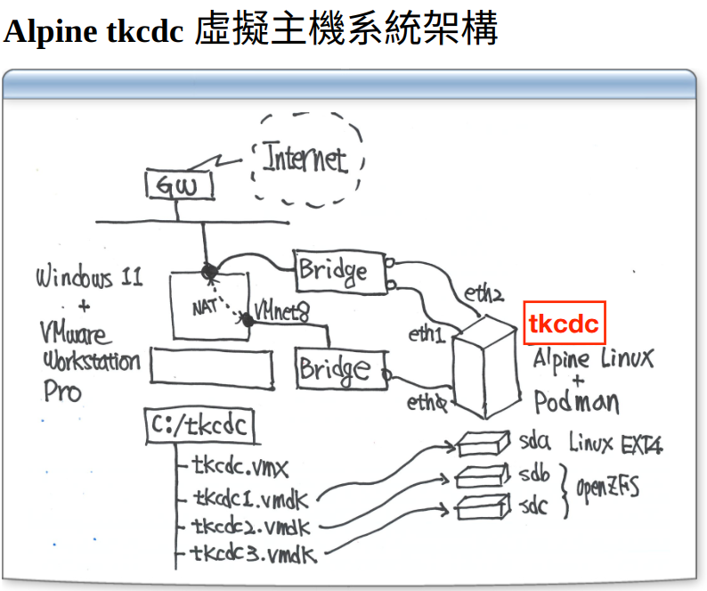
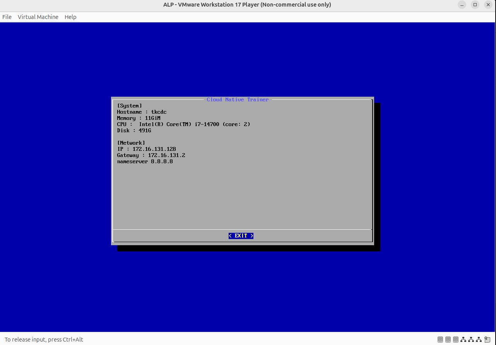

# 301-Taroko-K8S-Cluster

## Alpine tkcdc  虛擬主機



### Alpine Linux

```
Alpine Linux 是一套由社群開發，以安全為導向的 Linux 作業系統，目前最新的版本 v3.6.2 在 2017-06-17 發布。
跟一般的 Linux 發行版不一樣的地方是 Alpine 是使用 musl libc 和 busybox 來減少系統需求容量(5 MB )和執行消耗資源。
比起其他輕量化 Image (如：Busybox，Image 大小為1.113MB)， Alpine 的優勢在於多了像是 apt 之於 Ubuntu 這樣的套件管理工具 apk ，官方提供了大量的套件供開發者使用，可以透過網站或者直接下 apk 指令進行查詢或者安裝。

* Alpine 的 busybox 是 HardLink, 而不是 Softlink. Docker busybox image 沒有提供 套件安裝平台
```

### 硬體相關指令

- 主機硬體資訊 `wget -qO - http://www.oc99.org/sys/sysinfo | bash`

- 硬碟檔案系統 `sudo fdisk -l | grep -e "^Disk /dev"`
  - loop目錄修改，掛載不啟用虛擬機改檔案內容。

- 網路資訊 `ifconfig -a | grep -A 1 eth`
  - 可以看到虛擬網卡
  - ex: docker0 / podman0


### K8s設定

- 設定檔，多套K8s群集
  ```cmd
  sudo nano /etc/sysctl.conf
  
  # 編輯設定檔如下：
  fs.inotify.max_user_instances=1024   # 要設定這行 才能啟動多個 K8S 叢集
  net.ipv4.ip_forward=1
  ```

- 關閉 swap 功能 `sudo nano /etc/fstab`
  - 註解swap
  - 過去硬體設備不佳，使用硬碟來擴充替代
  - 但現今環境記憶體1T起跳，故要關掉這功能

- 課程中使用，平常可以評估安全性
  - `sudo nano /etc/sudoers`
  ```
  # Allow members of group sudo to execute any command
  %sudo   ALL=(ALL:ALL) NOPASSWD:ALL
  ```
  - 設定不會每次執行sudo詢問密碼
- 重新啟動 `sudo reboot`


### Taroko K8S 系統準備

- `wget -qO - http://www.oc99.org/tkprep.sh | bash`
  - 下載這台程式 從螢幕丟出，傳給bash script
  ```
  Ubuntu 24.04.2 LTS upgrade ok
  ~/cni ok
  kubectl ok
  tk2025v1.0.zip unzip ok
  ```

  - container network interface `CNI`
    - kubernetes在使用
  - kubectl
    - 用來維運kubernates
  - tk2025v1.0.zip
    - 老師寫的k8s地端系統

-----

- `kubectl version --client=true`
  - 1.32.3 是這個程式的命令版本
  - 實際管理k8s版本能夠向下相容，但千萬不要太舊
  ```
  Client Version: v1.32.3
  Kustomize Version: v5.5.0
  ```

- `podman version` or `docker version`
  ```
  Client:       Podman Engine
  Version:      4.9.3
  API Version:  4.9.3
  Go Version:   go1.22.2
  Built:        Thu Jan  1 08:00:00 1970
  OS/Arch:      linux/amd64
  ```

- `dir ~/tk`
  ```
  bin  conf  wulin
  ```

- `ls -l ~/tk/bin/k*`
  - 檢視自製程式 Taroko K8S 維運命令

- `cat ~/tk/conf/tk8s.conf`
  - 檢視tk8s設定檔

- `nano ~/tk/conf/tk8s.conf`
  - 修改設定檔
  ```
  # 取消自行創建的gateway
  export TKGW="false"
  ```

- `sudo nano /etc/profile`
  - 修改登入檔
  ```
  export PATH=~/tk/bin:$PATH
  alias dir='ls -alh'
  ```
  - `source /etc/profile`

-----

- `kls`
  - 老師自己寫的程式
  - 沒有建立時 `no clusters`

- `kto tk8s`
  - 產生tk8s系統
  - 大約要25分鐘

- `kgn tk8s`
  - 刪除tk8s
  - 如果遇到問題的刪除指令

#### 因kto安裝bug取代流程

- 使用VMware的ALP取代
  - 
  - 現場使用檔案：`alp.tkcdc.v1`
- `ssh bigred@<VM虛擬IP>`
  - `172.16.131.128`
  - user = passwd