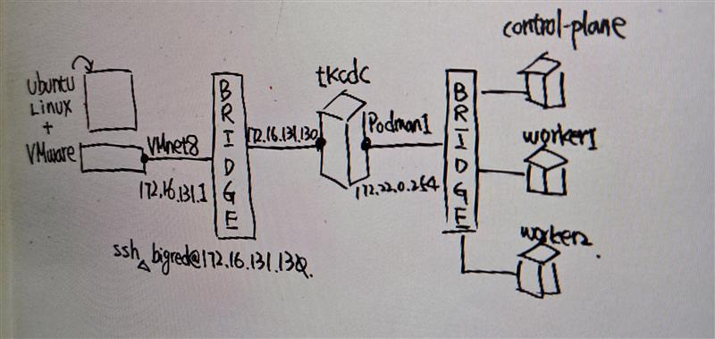
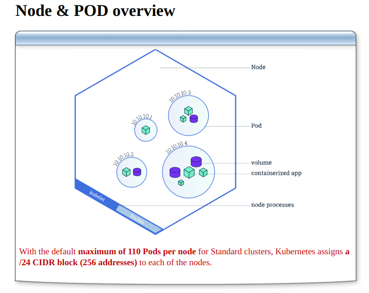
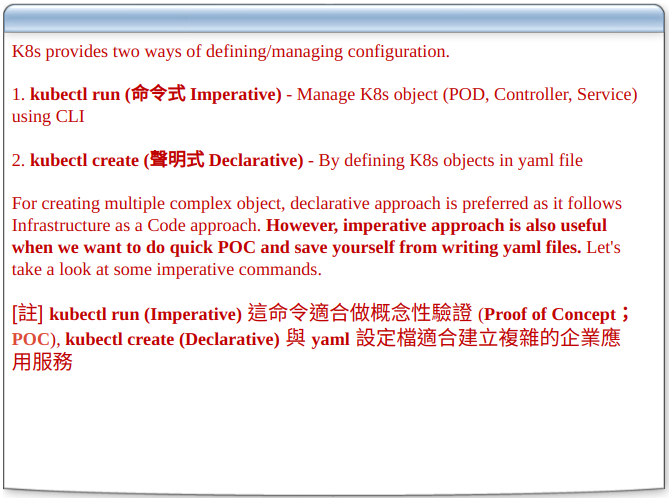
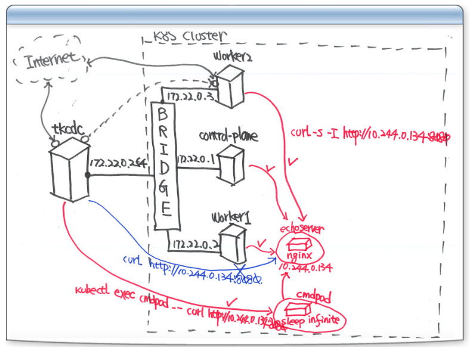
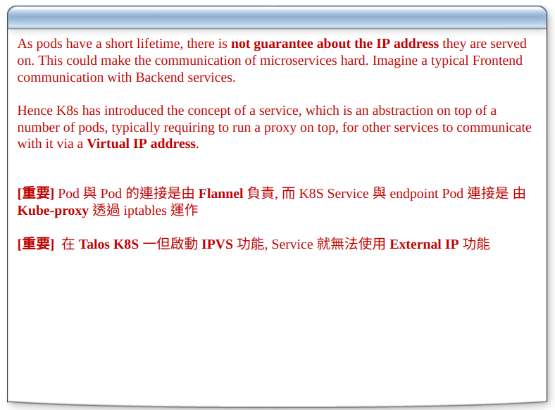
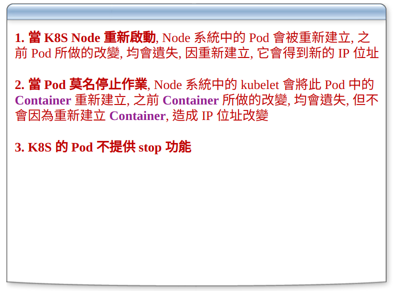
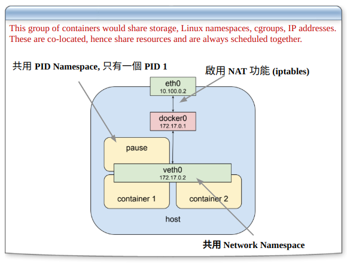

# 302-Taroko-K8S-Pod

## 手繪Cluser架構

- ifconfig 分別對linux主機與ssh主機查ip

- ubutu linux 主機 - VMnet8 虛擬網卡 - Bridge - tkcdc
- tkcdc - Podman1 虛擬網卡 - Bridge - pod
  - 連到app container
    - control plane
    - worker1
    - worker2 
- 


## Kubernetes POD

### 常用Taroko K8s指令

- 啟動
  - kci tk8s
  - Are you sure ? YES
- 關閉
  - kco tk8s


### Node & POD overview



- 1個Node預設最多110 POD
  - Taroko設定80 POD
- 工作一定要問Node設定多少個POD
- 通常Pod內不會超過三個

##### 補充-IP分配 
- `部份內容丟給copilot補完`

- **去頭去尾**：
  - 在 IP 分配中，通常會保留網段的第一個地址（網路地址）和最後一個地址（廣播地址），這些地址無法用於設備分配。
  - 例如，對於子網 `192.168.1.0/24`：
    - 網路地址：`192.168.1.0`
    - 廣播地址：`192.168.1.255`
    - 可用地址範圍：`192.168.1.1` 至 `192.168.1.254`

- **前10**：
  - 通常將子網的前 10 個 IP 地址分配給伺服器或基礎設施設備（如路由器、交換機、DNS 伺服器等）。
  - 例如，`192.168.1.1` 至 `192.168.1.10` 可以用於伺服器。

- **後5**：
  - 子網的最後 5 個 IP 地址可能會保留給特殊用途，例如管理設備或備援伺服器。
  - 例如，`192.168.1.250` 至 `192.168.1.254`。

- **一半 手動配**：
  - 剩餘的 IP 地址通常用於靜態分配，手動配置給特定設備（如伺服器、網路設備）。
  - 例如，`192.168.1.11` 至 `192.168.1.127` 可以用於靜態分配。

- **一半 DHCP**：
  - 子網的一部分 IP 地址會分配給 DHCP（動態主機配置協定）使用，通常從中間開始分配。
  - 例如，`192.168.1.128` 至 `192.168.1.200` 可以用於 DHCP 動態分配。


-----

### Kubernetes Object 佈署命令



- 維運兩個方式都會用到

1. kubectl run (命令式 Imperative) - Manage K8s object (POD, Controller, Service) using CLI

2. kubectl create (聲明式 Declarative) - By defining K8s objects in yaml file

- yml是機敏資料，可以知道k8s佈署的方式


## Single-Container Pods

- 輸入`kls`
```
tk8s:Up (Internal:1.32.2)
---------------------------------------
NAMESPACE            NAME                                         READY   STATUS    RESTARTS      AGE
kube-system          calico-kube-controllers-6b65fb5f89-66t62     1/1     Running   2 (70m ago)   18h
kube-system          canal-9dc5v                                  2/2     Running   4 (70m ago)   18h
kube-system          canal-ql5xj                                  2/2     Running   4 (70m ago)   18h
kube-system          canal-rv6n7                                  2/2     Running   4 (70m ago)   18h
kube-system          coredns-66967f4c59-sc4gn                     1/1     Running   2 (70m ago)   18h
kube-system          coredns-66967f4c59-zkpkl                     1/1     Running   2 (70m ago)   18h
kube-system          etcd-tk8s-control-plane                      1/1     Running   2 (70m ago)   19h
kube-system          kube-apiserver-tk8s-control-plane            1/1     Running   2 (70m ago)   19h
kube-system          kube-controller-manager-tk8s-control-plane   1/1     Running   2 (70m ago)   19h
kube-system          kube-proxy-4g4b7                             1/1     Running   2 (70m ago)   18h
kube-system          kube-proxy-lstnd                             1/1     Running   2 (70m ago)   18h
kube-system          kube-proxy-tpn5w                             1/1     Running   5 (70m ago)   19h
kube-system          kube-scheduler-tk8s-control-plane            1/1     Running   2 (70m ago)   19h
kube-system          metrics-server-8467fcc7b7-d9x4b              1/1     Running   4 (70m ago)   18h
local-path-storage   local-path-provisioner-84944977bd-fpmmz      1/1     Running   3 (70m ago)   18h
taroko               taroko-tkadm-74788d9f7c-qttc4                2/2     Running   4 (70m ago)   18h
```

- 三個kube-proxy

### 建立 echoserver Pod

- 指令 `kubectl run echoserver --image=registry.k8s.io/echoserver:1.10 --port 8080`
    ```
    pod/echoserver created
    ```

- image標準格式
  - 存放的伺服器: `registry.k8s.io`
  - image名稱: `echoserver`
  - 版本代號: `1.10`

- 指令 `kubectl get pods echoserver`
    ```
    NAME         READY   STATUS    RESTARTS   AGE
    echoserver   1/1     Running   0          93m
    ```

- 指令 `kubectl get pods -o wide`
    ```
    NAME         READY   STATUS    RESTARTS   AGE   IP             NODE           NOMINATED NODE   READINESS GATES
    echoserver   1/1     Running   0          94m   10.244.0.133   tk8s-worker1   <none>           <none>
    ``` 
  - 確認tk8s-worker

- 指令 `curl http://10.244.0.133:8080`
  - 在tkcdc輸入curl不會通
  - 沒有裝router進不去
  - `必考重點` : tkcdc與worker在不同網域
    - tkcdc : 172.22.0.254
    - woker : 10.244.0.133
  - 重點 `kubepoxy` 負責worker對外溝通


### 建立 cloudwalker pod

- 指令 `kubectl run a1 --image=quay.io/cloudwalker/alp.base`
  - 建議使用`quay.io` : 紅帽的
  - 因為`docker.io` 逃難潮發生中，只能限制10次
- 指令 `kubectl get pods -o wide`
    ```
    NAME         READY   STATUS              RESTARTS   AGE    IP             NODE           NOMINATED NODE   READINESS GATES
    a1           0/1     ContainerCreating   0          4s     <none>         tk8s-worker1   <none>           <none>
    echoserver   1/1     Running             0          112m   10.244.0.133   tk8s-worker1   <none>           <none>
    ```
    - ContainerCreating image下載中
    - 如果內網下載超過太久，需要開始抓兇手
- 指令 `kubectl exec a1 -- curl -I http://10.244.0.133:8080`
  - `--` 
    - 在減號前面是kubectl的命令
    - 在減號後面是要對pod下的參數
    ```
    % Total    % Received % Xferd  Average Speed   Time    Time     Time  Current
                                    Dload  Upload   Total   Spent    Left  Speed
    0     0    0     0    0     0      0      0 --:--:-- --:--:-- --:--:--     0HTTP/1.1 200 OK
    Date: Tue, 22 Apr 2025 05:57:13 GMT
    Content-Type: text/plain
    Connection: keep-alive
    Server: echoserver

    0     0    0     0    0     0      0      0 --:--:-- --:--:-- --:--:--     0
    ```
- 連線方式證明，塞一個pod到tk8s-worker1，使用a1 pod 執行curl。

##### `必考重點`: 

- pod與pod之間溝通要靠誰？(叢集內部)
  - Container Network Interface `CNI`
- 同一個Node內，虛擬橋接器連線
  - 網路速度: 20Gi(記憶體作業)
- 如果pod在不同的Node時
  - tunnel 傳送封包，static route 相較比較慢

##### `工作案例`:

- 案例: 如果實體機網路用1Gi時，會有網路失連出是的疑慮
  - 至少要10Gi起跳
  - 如果用到`ceph` 100Gi起跳

### 登入 Single-Container POD

- 指令 `kubectl exec -it a1 -- sh`
  - 呼叫貝殼程式一定要有終端機，故在exec pod前面要加 -it 使用虛擬終端機
- 指令 `ps aux`
    ```
    USER         PID %CPU %MEM    VSZ   RSS TTY      STAT START   TIME COMMAND
    root           1  0.0  0.0   6572  2176 ?        Ss   13:51   0:00 /bin/sleep infinity
    root          44  0.0  0.0   1708  1152 pts/0    Ss   14:19   0:00 sh
    root          52  0.0  0.0   2524  1664 pts/0    R+   14:30   0:00 ps aux
    ```
- image內防護
  - pod內避免一些防止破壞的指令

- 指令 `kubectl exec echoserver -- hostname -i`
  - 檢查echoserver的ip


### 建立與連接POD




### 建立 K8S 檢測命令 - kc

- 建立測試之用的 Pod
- 指令 `kubectl run cmdpod --image=quay.io/cloudwalker/alp.base`

- 指令 `kubectl exec cmdpod -- timeout 5 curl -s -I http://10.244.0.133:8080`
    ```
    HTTP/1.1 200 OK
    Date: Tue, 22 Apr 2025 06:39:22 GMT
    Content-Type: text/plain
    Connection: keep-alive
    Server: echoserver
    ```
- 指令 `alias kc='kubectl exec cmdpod -- '`
    - 設定別名
- 指令 `kc timeout 5 curl -s -I http://10.244.0.133:8080`
    ```
    HTTP/1.1 200 OK
    Date: Tue, 22 Apr 2025 06:43:32 GMT
    Content-Type: text/plain
    Connection: keep-alive
    Server: echoserver
    ```

- 指令 `kubectl delete pod echoserver --force`

- 流行趨勢: linux命令用k8s製作出來，沒有用髒作業系統

## 建立 K8S Service

### 認識 Kubernetes Service



- 參考將投影片內文餵給, codpilot

#### 問題背景：

- Pod 是短暫的，可能會隨時被刪除或重新建立，這導致 Pod 的 IP 地址不穩定。
- 如果微服務之間需要通信（例如前端與後端服務），Pod 的 IP 地址變化會使通信變得困難。

#### 解決方案：

- Kubernetes 引入了 Service 的概念，作為 Pod 的抽象層。
- Service 提供一個穩定的虛擬 IP 地址（Virtual IP），讓其他服務可以通過這個 IP 與目標 Pod 通信，而不需要關心 Pod 的實際 IP。

#### Service 與網路運作

1. Pod 與 Pod 的連接：

   - Pod 之間的通信由 Flannel（或其他 CNI 插件）負責。
   - Flannel 提供叢集內部的網路連接，確保不同 Node 上的 Pod 可以互相通信。

2. Service 與 Pod 的連接：

   - Kube-proxy 是 Kubernetes 中的網路代理，負責管理 Service 與其後端 Pod（Endpoint）之間的連接。
   - Kube-proxy 通過 iptables 或 IPVS 實現流量轉發，將發往 Service 的流量路由到對應的 Pod。

#### 重點

1. Pod 與 Pod 的連接： 由 Flannel 或其他 CNI 插件負責，確保叢集內部的網路通信。
2. Service 與 Pod 的連接： 由 Kube-proxy 通過 iptables 或 IPVS 實現，提供穩定的虛擬 IP 地址。

-----


### 建立 K8S Service - ClusterIP


- 參考圖例IP位置
- service照顧的pod
  - 透過label標定，讓service selector能夠挑選到
    - `label:run=echoserver`
- 重要: K8S命名法則是很大的挑戰
- 使用者 -> service -> pod

### 建立 echoserver Service

- 指令 `kubectl run echoserver --image=registry.k8s.io/echoserver:1.10 --port 8080 --expose`
  - `expose` 加這個參數會自行建立服務
  - `Error from server (AlreadyExists): pods "echoserver" already exists`
  - 排除指令 `kubectl delete pod echoserver`
    - delete要稍微等一下 system 發送 信號15 給 operation
    - 要確認app有沒有接收關機訊號的function
      - `spring boot有這個function 文件有`
  ```
  service/echoserver created
  pod/echoserver created
  ```
- 指令 `kubectl get all`
    ```
    NAME             READY   STATUS    RESTARTS   AGE
    pod/a1           1/1     Running   0          77m
    pod/cmdpod       1/1     Running   0          30m
    pod/echoserver   1/1     Running   0          39s

    NAME                 TYPE        CLUSTER-IP    EXTERNAL-IP   PORT(S)    AGE
    service/echoserver   ClusterIP   10.98.0.228   <none>        8080/TCP   39s
    service/kubernetes   ClusterIP   10.98.0.1     <none>        443/TCP    22h
    ```

- 指令 `curl -I http://10.98.0.228:8080`
  - 外部連線找不到
  - service拿到的IP是CLUSTER-IP，只能在叢集內可以用
- 指令 `kc timeout 5 curl -s -I http://10.98.0.228:8080`
    ```
    HTTP/1.1 200 OK
    Date: Tue, 22 Apr 2025 07:15:26 GMT
    Content-Type: text/plain
    Connection: keep-alive
    Server: echoserver
    ```
  - 使用別名kc，前面埋進去的pod，執行curl指令

- 指令 `kubectl get all -o wide --show-labels`
  - 顯示所有的label
    ```
    NAME             READY   STATUS    RESTARTS   AGE     IP             NODE           NOMINATED NODE   READINESS GATES   LABELS
    pod/a1           1/1     Running   0          86m     10.244.0.134   tk8s-worker1   <none>           <none>            run=a1
    pod/cmdpod       1/1     Running   0          39m     10.244.0.135   tk8s-worker1   <none>           <none>            run=cmdpod
    pod/echoserver   1/1     Running   0          9m43s   10.244.1.8     tk8s-worker2   <none>           <none>            run=echoserver

    NAME                 TYPE        CLUSTER-IP    EXTERNAL-IP   PORT(S)    AGE     SELECTOR         LABELS
    service/echoserver   ClusterIP   10.98.0.228   <none>        8080/TCP   9m43s   run=echoserver   <none>
    service/kubernetes   ClusterIP   10.98.0.1     <none>        443/TCP    22h     <none>           component=apiserver,provider=kubernetes
    ```
  - 發現service有對應selector，工作上也要注意命名是否正確。

-----

### 必須知道的重點



- K8S System內，資料跟功能分離
- 驗收：把POD建立,刪除,重建
  - 程式設計師：要做資料的回存，例如用finalize
- RESTARTS `重建的次數`
  - 維運時特別需要注意
  - 有些設計不要重建，才能即時確認錯誤

-----

## 直接對外連接 hostPort

- k8s後面版本有的功能
  - 可以使用裸POD
- `host` : k8s的node
- node上會開tcp/ip的port

### 產生 echoserver POD yaml 檔

- 指令 `kubectl run echoserver --image=registry.k8s.io/echoserver:1.10  --port 8080 --dry-run=client -o yaml > ~/tk/wulin/yaml/echosrv.yaml`
  - `dry-run=client` : 不會產生POD, 會產生yml檔
  - `-o` : 決定格式
  - yml檔很多模板範本，各版本不同，透過指令產生較合理
- 指令 建立別名
    ```
    alias ka='kubectl apply'
    alias kc='kubectl exec cmdpod -- '
    alias kd='kubectl delete'
    alias kg='kubectl get'
    ```
- 指令 `nano ~/tk/wulin/yaml/echosrv.yaml`
  - 確認yml
    ```yml
    apiVersion: v1
    kind: Pod
    metadata:
        creationTimestamp: null
        labels:
            run: echoserver
        name: echoserver
    spec:
        containers:
        - image: registry.k8s.io/echoserver:1.10
            name: echoserver
            ports:
            - containerPort: 8080
              hostPort: 9000 # 加入這行
    ```
  - 先看kind
  - 類型Pod 看metadata
  - containers
    - 看image數量

-----

### 檢測 echoserver hostPort

- 指令 `kubectl apply -f ~/tk/wulin/yaml/echosrv.yaml`
  - 透過yml產生pod

- 指令 `kubectl get pod -o wide`
    - 確認建立的pod
    ```
    NAME         READY   STATUS    RESTARTS   AGE    IP             NODE           NOMINATED NODE   READINESS GATES
    a1           1/1     Running   0          131m   10.244.0.134   tk8s-worker1   <none>           <none>
    cmdpod       1/1     Running   0          84m    10.244.0.135   tk8s-worker1   <none>           <none>
    echoserver   1/1     Running   0          18s    10.244.1.9     tk8s-worker2   <none>           <none>
    ```

- 指令 `kubectl get nodes -o wide`
    ```
    NAME                 STATUS   ROLES            AGE   VERSION   INTERNAL-IP   EXTERNAL-IP   OS-IMAGE                         KERNEL-VERSION     CONTAINER-RUNTIME
    tk8s-control-plane   Ready    control-plane    23h   v1.32.2   172.22.0.1    <none>        Debian GNU/Linux 12 (bookworm)   6.8.0-58-generic   containerd://2.0.3
    tk8s-worker1         Ready    taroko-worker    23h   v1.32.2   172.22.0.2    <none>        Debian GNU/Linux 12 (bookworm)   6.8.0-58-generic   containerd://2.0.3
    tk8s-worker2         Ready    taroko-gateway   23h   v1.32.2   172.22.0.3    <none>        Debian GNU/Linux 12 (bookworm)   6.8.0-58-generic   containerd://2.0.3
    ```

- 找到worker2 ip, 測試前面設定的hostPort

- 指令 `curl -I http://172.22.0.3:9000`
    ```
    HTTP/1.1 200 OK
    Date: Tue, 22 Apr 2025 08:07:30 GMT
    Content-Type: text/plain
    Connection: keep-alive
    Server: echoserver
    ```

- 這種方式適用地端


- 關閉k8s
- 指令 `kco tk8s`
    ```
    Are you sure ? YES
    tkadd-dnat.sh tkdel-dnat.sh created
    tk8s-control-plane /etc/hosts ok
    tk8s-worker1 /etc/hosts ok
    tk8s-worker2 /etc/hosts ok
    tk8s-worker2 Exited
    tk8s-worker1 Exited
    tk8s-control-plane Exited
    tk8s: clock out
    ```

#### 網路速度探討

- 關鍵字輸入copilot

1. 網路上不建議db放在k8s內
   - 原因：
     - 性能瓶頸：資料庫通常需要高效能的 I/O 和穩定的網路連接，而 Kubernetes 的網路層（如 CNI 插件）可能會引入額外的延遲。
     - 狀態性問題：資料庫是狀態性應用，而 Kubernetes 更適合無狀態應用（如微服務）。Pod 的短暫性和重啟可能導致資料庫的狀態不穩定。
     - 存儲需求：資料庫需要高效能的持久化存儲，而 Kubernetes 的存儲解決方案（如 CSI 插件）可能無法滿足高 IOPS 的需求。
     - 網路拓撲：Kubernetes 的網路抽象層（如 Service 和 kube-proxy）可能會增加網路跳數，影響資料庫的性能。
   - 建議：
     - 將資料庫部署在專用的實體機或虛擬機上，確保穩定性和高效能。
     - 使用雲端提供的資料庫服務（如 AWS RDS、Azure SQL Database、GCP Cloud SQL），這些服務針對資料庫進行了優化。

2. 實體主機網速取決實體網卡
   - 原因：
     - 實體主機的網路速度主要由網卡的規格決定，例如 1Gbps、10Gbps 或更高。
     - 如果 Kubernetes 的 Node 使用低速網卡（如 1Gbps），在高流量場景下可能會成為瓶頸。
     - 特別是當 Pod 之間需要大量數據傳輸（如資料庫查詢或大文件傳輸）時，網卡性能至關重要。
   - 建議：
     - 使用至少 10Gbps 的網卡，特別是對於需要高網路吞吐量的應用（如資料庫或大數據處理）。
     - 如果使用分散式存儲（如 Ceph），建議使用 25Gbps 或更高的網卡，以避免網路成為瓶頸。
3. hostPort
   - 概念：
     - Kubernetes 的 hostPort 功能允許 Pod 直接綁定到 Node 的指定端口，從而使外部流量可以直接訪問該 Pod。
     - 這種方式繞過了 Kubernetes 的 Service 和 kube-proxy，直接使用 Node 的網路接口。
   - 優點：
     - 簡單直接，適合需要快速對外暴露的應用。
     - 適用於地端環境（如內部測試或開發環境），不需要額外的負載均衡器。
   - 缺點：
     - 端口衝突：每個 Node 的端口是有限的，使用 hostPort 可能導致端口衝突。
     - 可擴展性差：hostPort 綁定到特定的 Node，無法輕易擴展到多個 Node。
     - 網路性能：hostPort 的性能取決於 Node 的網卡和網路配置，可能無法滿足高流量需求。
   - 建議：
     - 僅在需要直接對外暴露的應用中使用 hostPort，例如簡單的測試服務或內部工具。
     - 在生產環境中，建議使用 Kubernetes 的 LoadBalancer 或 Ingress 來管理外部流量。

4. 如果不是裸POD，要經過IP Table
  - 說明：
    - 非裸 Pod 的網路流量需要通過 Kubernetes 的網路代理（如 kube-proxy）進行處理。
    - kube-proxy 通過 **iptables** 或 **IPVS** 實現流量轉發，將流量從 Service 路由到對應的 Pod。
    - 這種方式增加了網路跳數，可能會引入額外的延遲。

  - 裸 Pod 的特性：
    - 使用 `hostNetwork: true` 的 Pod 可以直接使用 Node 的網路接口，無需通過 iptables 或 kube-proxy。
    - 適合需要高性能網路的場景，但可能導致端口衝突或網路配置複雜化。

5. 在 Kubernetes 中的網路跳數
   1. Pod 與 Pod 的通信：
      - 同一 Node：
        - Pod 通過虛擬橋接器（如 cbr0 或 docker0）直接通信，跳數為 1。
        - 這是最快的通信方式，因為數據不需要離開 Node。
      - 不同 Node：
        - Pod 通信需要通過 CNI 插件（如 Flannel、Calico）建立的隧道（Tunnel），數據封包需要經過多個網路設備（如路由器或交換機），跳數通常為 2 或更多。
   2. Service 與 Pod 的通信：
      - 當流量通過 Kubernetes 的 Service 時，會經過 kube-proxy。
      - kube-proxy 使用 iptables 或 IPVS 將流量路由到目標 Pod，這會增加額外的跳數。
      - 如果 Service 是 ClusterIP，流量會在叢集內部轉發，跳數通常為 2 或更多。
      - 如果 Service 是 NodePort 或 LoadBalancer，流量可能需要經過外部負載均衡器，跳數會進一步增加。
   3. 外部流量進入叢集：
      - 當外部流量進入 Kubernetes 叢集時，通常需要經過以下幾個步驟：
        - 外部負載均衡器（如雲端提供的 LoadBalancer）。
        - Kubernetes 的 NodePort 或 Ingress。
        - 最終到達目標 Pod。
      - 這種情況下，跳數可能為 3 或更多。

-----

## Pod Log Rotation

- Pod Log: 討論要怎樣做
- Rotation: 總量控管作法

### 檢測 Pod Log Rotation 功能

- `五顆星重點`

- 指令 `cat  ~/tk/wulin/yaml/pod-log.yaml`
  ```yaml
  apiVersion: v1
  kind: Pod
  metadata:
    name: pod-log
  spec:
    containers:
    - name: pod-log
      image: quay.io/cloudwalker/alp.base
      command: ["/bin/sh"] # app container 執行的命令
      args:
      - -c
      # 產生在overlay2的 /var/log
      # 迴圈產生時間日期 count
      - |
        mkdir -p /var/log;i=0;
        while true;
        do
          echo "$(date) INFO $i";  
          i=$((i+1));
        done
  ```
- pod產生的螢幕輸出，會被`K8S的log機制`收走，導向指定的目錄區
  - 會存在某個Node主機的檔案系統
  - 前述的無窮迴圈如果一直寫入，會導致硬碟爆掉
    - 雲端則會存在雲端商的檔案系統內，導致費用爆增。
    - 傳統機房會設定Log上限，注意雲端商的設定。

- 指令 `ka -f ~/tk/wulin/yaml/pod-log.yaml`
  ```
  pod/pod-log created
  ```
- 指令 `kg pods pod-log -o wide`
  ```
  NAME      READY   STATUS    RESTARTS   AGE   IP             NODE           NOMINATED NODE   READINESS GATES
  pod-log   1/1     Running   0          42s   10.244.0.139   tk8s-worker1   <none>           <none>
  ```

- 指令 `kubectl logs pod-log`
  - 檢視Pod Log

- 指令 `kubectl debug node/tk8s-worker1 -it --image=quay.io/cloudwalker/busybox`
  - 規定：K8s node主機不能開ssh server
  - `kubectl debug`: 創造pod到指定的worker node，檢視檔案系統內容
  - `-it`: 虛擬終端機
  - `busybox`: docker提供的image, 內定會執行sh, 故不用在命令列輸入
    - size小,功能幾乎具備
- 執行命令，會進入pod內，但有能力看到檔案系統

- 指令 #`ls -al /host/var/log/pods`
  - `/host`: 掛載在worker1檔案系統的根目錄
  - 儲存所有pod的log
- 指令 #`ls -al /host/var/log/pods | grep 'default_pod-log'`
  - 路徑接續往下找 `default_pod-log_XXXXXX`
  - 路徑接續往下找 `pod-log`
  ```
  drwxr-xr-x    2 root     root          4096 Apr 23 01:53 .
  drwxr-xr-x    3 root     root          4096 Apr 23 01:31 ..
  -rw-r-----    1 root     root       1092528 Apr 23 01:53 0.log
  -rw-r--r--    1 root     root        120113 Apr 23 01:53 0.log.20250423-015259.gz
  -rw-r-----    1 root     root       1148376 Apr 23 01:53 0.log.20250423-015309
  ```
  - 在/var底下，可以進行修改刪除

-----

## Multi-Container Pods

### 解析 Kubernetes Pod 內部結構



- 三個container共用同一片虛擬網卡
- 技術: linux `network namespace`


### 建立 Share PID Namespace Pod

- 指令 `cat ~/tk/wulin/yaml/sharepid.yml`
  - linux process namespace 有自己的名稱
    - 通常app container PID 1 是自己
  - 設定`shareProcessNamespace`
  ```yml
  apiVersion: v1
  kind: Pod
  metadata:
    name: sharepid
    annotations:
      kubectl.kubernetes.io/default-container: "shell"
  spec:
    shareProcessNamespace: true
    # 指定電腦名稱
    hostname: xyz 
    containers:
    - name: derby
      image: quay.io/cloudwalker/alpine.derby
      imagePullPolicy: Always
    - name: shell
      image: quay.io/cloudwalker/alp.base
      imagePullPolicy: IfNotPresent
      tty: true  
  ```

- 指令 `kubectl create -f ~/tk/wulin/yaml/sharepid.yml`
  - create 做的物件比較多
    - 但做出來的物件不能更改
  - apply 做出來的物件比較少
    - 內部規格可以局部修改

- 指令 `kubectl get pod/sharepid -o jsonpath='{.spec.containers[*].name}';echo ""`
  - 內部container名稱
  ```
  derby shell
  ```

- 指令 `kubectl exec sharepid  -c shell -- hostname; kubectl exec sharepid  -c derby -- hostname`
  - `-c` 指定container
  - 詢問shell, derby namespace name
  - 確認namespace name相同
  ```
  xyz
  xyz
  ```

- 指令 `kubectl exec sharepid  -c shell -- hostname -i; kubectl exec sharepid  -c derby -- hostname -i`
  - 確認網卡相同
  ```
  10.244.0.140
  10.244.0.140
  ```

- 指令 `kubectl exec -it sharepid -- curl http://localhost:8888`
  ```
  <h1>Welcome to Spring Boot</h1>
  ```

- 指令 `kubectl exec -it sharepid -- ps aux`
  - `/pause` : sleep infinity
    - 只要k8s創造pod，一定會有隱藏的 `pause app container`
    - 開啟 `shareProcessNamespace` 才看得到
    - 1.18版已經鎖住
  ```
  USER         PID %CPU %MEM    VSZ   RSS TTY      STAT START   TIME COMMAND
  65535          1  0.0  0.0   1020   640 ?        Ss   10:23   0:00 /pause
  root           6  0.0  0.0   2180  1536 ?        Ss   10:23   0:00 bash -c /derb
  root          19  1.0  3.6 5756296 593608 ?      Sl   10:23   0:09 java -jar -Dd
  root          26  0.0  0.0   6572  2176 pts/0    Ss+  10:23   0:00 /bin/sleep in
  root         126  0.0  0.0   2524  1664 pts/1    Rs+  10:39   0:00 ps aux
  ```

- 指令 `kubectl exec -it sharepid -- mkdir /proc/6/root/home/bigred`
  - 可以用這個方式，知道PID後，進入檔案系統，執行作業
- 指令 `kubectl exec -it sharepid  -c derby -- ls -al /home`
  - 確認資料夾是否產生
  ```
  drwxr-xr-x 1 root root 4096 Apr 23 02:50 .
  drwxr-xr-x 1 root root 4096 Apr 23 02:23 ..
  drwxr-xr-x 2 root root 4096 Apr 23 02:50 bigred
  ```

- 案例 oracle mysql image
  - 沒有ifconfig
  - 解決辦法1: Dockerfile調整自己想要的image
  - 老師的思路
    - 從同一個namespace app container
      - 傳入指令
      - 或從PID去改檔案系統內的資訊
    - 不用改image

- 指令 `kubectl exec -it sharepid  -c shell -- ls -al /proc/1/root/`
  ```
  ls: cannot access '/proc/1/root/': Permission denied
  command terminated with exit code 2
  ```
  - 因 shareip 這個 POD 的 pause container(3.0 ~ 3.5 版), 不存在 sh 命令, 以至無法登入, 但可執行以下命令, 檢視 pause container 的檔案系統 

-----