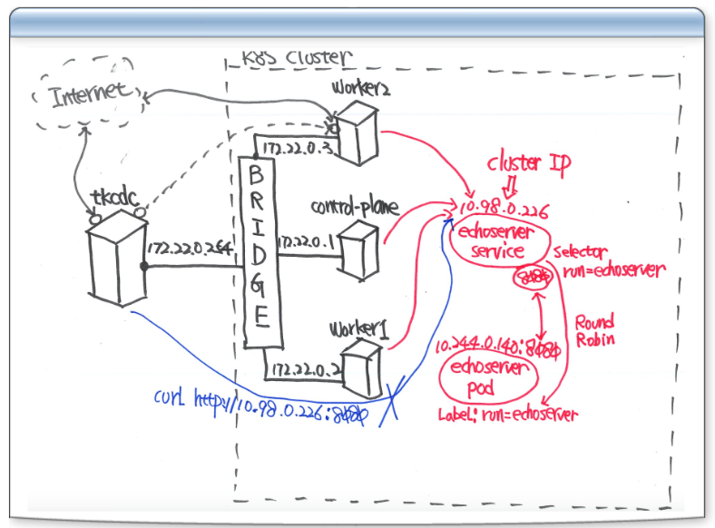

# 302-Taroko-K8S-Pod

## Kubernetes POD

### 常用Taroko K8s指令

- 啟動
  - kci tk8s
  - Are you sure ? YES
- 關閉
  - kco tk8s


### Node & POD overview


- 1個Node預設最多110 POD
  - Taroko設定80 POD
- 工作一定要問Node設定多少個POD
- 通常Pod內不會超過三個

##### 補充-IP分配 

- 去頭去尾
- 前10 server
- 後5 
- 一半 DHCP(128起跳)
- 一半 手動配

### Kubernetes Object 佈署命令


- 維運兩個方式都會用到

1. kubectl run (命令式 Imperative) - Manage K8s object (POD, Controller, Service) using CLI

2. kubectl create (聲明式 Declarative) - By defining K8s objects in yaml file

- yml是機敏資料，可以知道k8s佈署的方式


## Single-Container Pods

- 輸入`kls`
```
tk8s:Up (Internal:1.32.2)
---------------------------------------
NAMESPACE            NAME                                         READY   STATUS    RESTARTS      AGE
kube-system          calico-kube-controllers-6b65fb5f89-66t62     1/1     Running   2 (70m ago)   18h
kube-system          canal-9dc5v                                  2/2     Running   4 (70m ago)   18h
kube-system          canal-ql5xj                                  2/2     Running   4 (70m ago)   18h
kube-system          canal-rv6n7                                  2/2     Running   4 (70m ago)   18h
kube-system          coredns-66967f4c59-sc4gn                     1/1     Running   2 (70m ago)   18h
kube-system          coredns-66967f4c59-zkpkl                     1/1     Running   2 (70m ago)   18h
kube-system          etcd-tk8s-control-plane                      1/1     Running   2 (70m ago)   19h
kube-system          kube-apiserver-tk8s-control-plane            1/1     Running   2 (70m ago)   19h
kube-system          kube-controller-manager-tk8s-control-plane   1/1     Running   2 (70m ago)   19h
kube-system          kube-proxy-4g4b7                             1/1     Running   2 (70m ago)   18h
kube-system          kube-proxy-lstnd                             1/1     Running   2 (70m ago)   18h
kube-system          kube-proxy-tpn5w                             1/1     Running   5 (70m ago)   19h
kube-system          kube-scheduler-tk8s-control-plane            1/1     Running   2 (70m ago)   19h
kube-system          metrics-server-8467fcc7b7-d9x4b              1/1     Running   4 (70m ago)   18h
local-path-storage   local-path-provisioner-84944977bd-fpmmz      1/1     Running   3 (70m ago)   18h
taroko               taroko-tkadm-74788d9f7c-qttc4                2/2     Running   4 (70m ago)   18h
```

- 三個kube-proxy

### 建立 echoserver Pod

- 指令 `kubectl run echoserver --image=registry.k8s.io/echoserver:1.10 --port 8080`
    ```
    pod/echoserver created
    ```

- image標準格式
  - 存放的伺服器: `registry.k8s.io`
  - image名稱: `echoserver`
  - 版本代號: `1.10`

- 指令 `kubectl get pods echoserver`
    ```
    NAME         READY   STATUS    RESTARTS   AGE
    echoserver   1/1     Running   0          93m
    ```

- 指令 `kubectl get pods -o wide`
    ```
    NAME         READY   STATUS    RESTARTS   AGE   IP             NODE           NOMINATED NODE   READINESS GATES
    echoserver   1/1     Running   0          94m   10.244.0.133   tk8s-worker1   <none>           <none>
    ``` 
  - 確認tk8s-worker

- 指令 `curl http://10.244.0.133:8080`
  - 在tkcdc輸入curl不會通
  - 沒有裝router進不去
  - `必考重點` : tkcdc與worker在不同網域
    - tkcdc : 172.22.0.254
    - woker : 10.244.0.133
  - 重點 `kubepoxy` 負責worker對外溝通


### 建立 cloudwalker pod

- 指令 `kubectl run a1 --image=quay.io/cloudwalker/alp.base`
  - 建議使用`quay.io` : 紅帽的
  - 因為`docker.io` 逃難潮發生中，只能限制10次
- 指令 `kubectl get pods -o wide`
    ```
    NAME         READY   STATUS              RESTARTS   AGE    IP             NODE           NOMINATED NODE   READINESS GATES
    a1           0/1     ContainerCreating   0          4s     <none>         tk8s-worker1   <none>           <none>
    echoserver   1/1     Running             0          112m   10.244.0.133   tk8s-worker1   <none>           <none>
    ```
    - ContainerCreating image下載中
    - 如果內網下載超過太久，需要開始抓兇手
- 指令 `kubectl exec a1 -- curl -I http://10.244.0.133:8080`
  - `--` 
    - 在減號前面是kubectl的命令
    - 在減號後面是要對pod下的參數
    ```
    % Total    % Received % Xferd  Average Speed   Time    Time     Time  Current
                                    Dload  Upload   Total   Spent    Left  Speed
    0     0    0     0    0     0      0      0 --:--:-- --:--:-- --:--:--     0HTTP/1.1 200 OK
    Date: Tue, 22 Apr 2025 05:57:13 GMT
    Content-Type: text/plain
    Connection: keep-alive
    Server: echoserver

    0     0    0     0    0     0      0      0 --:--:-- --:--:-- --:--:--     0
    ```
- 連線方式證明，塞一個pod到tk8s-worker1，使用a1 pod 執行curl。

##### `必考重點`: 

- pod與pod之間溝通要靠誰？(叢集內部)
  - Container Network Interface `CNI`
- 同一個Node內，虛擬橋接器連線
  - 網路速度: 20Gi(記憶體作業)
- 如果pod在不同的Node時
  - tunnel 傳送封包，static route 相較比較慢

##### `工作案例`:

- 案例: 如果實體機網路用1Gi時，會有網路失連出是的疑慮
  - 至少要10Gi起跳
  - 如果用到`ceph` 100Gi起跳

### 登入 Single-Container POD

- 指令 `kubectl exec -it a1 -- sh`
  - 呼叫貝殼程式一定要有終端機，故在exec pod前面要加 -it 使用虛擬終端機
- 指令 `ps aux`
    ```
    USER         PID %CPU %MEM    VSZ   RSS TTY      STAT START   TIME COMMAND
    root           1  0.0  0.0   6572  2176 ?        Ss   13:51   0:00 /bin/sleep infinity
    root          44  0.0  0.0   1708  1152 pts/0    Ss   14:19   0:00 sh
    root          52  0.0  0.0   2524  1664 pts/0    R+   14:30   0:00 ps aux
    ```
- image內防護
  - pod內避免一些防止破壞的指令

- 指令 `kubectl exec echoserver -- hostname -i`
  - 檢查echoserver的ip


### 建立與連接POD


### 建立 K8S 檢測命令 - kc

- 建立測試之用的 Pod
- 指令 `kubectl run cmdpod --image=quay.io/cloudwalker/alp.base`

- 指令 `kubectl exec cmdpod -- timeout 5 curl -s -I http://10.244.0.133:8080`
    ```
    HTTP/1.1 200 OK
    Date: Tue, 22 Apr 2025 06:39:22 GMT
    Content-Type: text/plain
    Connection: keep-alive
    Server: echoserver
    ```
- 指令 `alias kc='kubectl exec cmdpod -- '`
    - 設定別名
- 指令 `kc timeout 5 curl -s -I http://10.244.0.133:8080`
    ```
    HTTP/1.1 200 OK
    Date: Tue, 22 Apr 2025 06:43:32 GMT
    Content-Type: text/plain
    Connection: keep-alive
    Server: echoserver
    ```

- 指令 `kubectl delete pod echoserver --force`

- 流行趨勢: linux命令用k8s製作出來，沒有用髒作業系統

## 建立 K8S Service

### 認識 Kubernetes Service


- 參考將投影片內文餵給, codpilot

#### 問題背景：

- Pod 是短暫的，可能會隨時被刪除或重新建立，這導致 Pod 的 IP 地址不穩定。
- 如果微服務之間需要通信（例如前端與後端服務），Pod 的 IP 地址變化會使通信變得困難。

#### 解決方案：

- Kubernetes 引入了 Service 的概念，作為 Pod 的抽象層。
- Service 提供一個穩定的虛擬 IP 地址（Virtual IP），讓其他服務可以通過這個 IP 與目標 Pod 通信，而不需要關心 Pod 的實際 IP。

#### Service 與網路運作

1. Pod 與 Pod 的連接：

   - Pod 之間的通信由 Flannel（或其他 CNI 插件）負責。
   - Flannel 提供叢集內部的網路連接，確保不同 Node 上的 Pod 可以互相通信。

2. Service 與 Pod 的連接：

   - Kube-proxy 是 Kubernetes 中的網路代理，負責管理 Service 與其後端 Pod（Endpoint）之間的連接。
   - Kube-proxy 通過 iptables 或 IPVS 實現流量轉發，將發往 Service 的流量路由到對應的 Pod。

#### 重點

1. Pod 與 Pod 的連接： 由 Flannel 或其他 CNI 插件負責，確保叢集內部的網路通信。
2. Service 與 Pod 的連接： 由 Kube-proxy 通過 iptables 或 IPVS 實現，提供穩定的虛擬 IP 地址。

-----


### 建立 K8S Service - ClusterIP


- 參考圖例IP位置
- service照顧的pod
  - 透過label標定，讓service selector能夠挑選到
    - `label:run=echoserver`
- 重要: K8S命名法則是很大的挑戰
- 使用者 -> service -> pod

### 建立 echoserver Service

- 指令 `kubectl run echoserver --image=registry.k8s.io/echoserver:1.10 --port 8080 --expose`
  - `expose` 加這個參數會自行建立服務
  - `Error from server (AlreadyExists): pods "echoserver" already exists`
  - 排除指令 `kubectl delete pod echoserver`
    - delete要稍微等一下 system 發送 信號15 給 operation
    - 要確認app有沒有接收關機訊號的function
      - `spring boot有這個function 文件有`
  ```
  service/echoserver created
  pod/echoserver created
  ```
- 指令 `kubectl get all`
    ```
    NAME             READY   STATUS    RESTARTS   AGE
    pod/a1           1/1     Running   0          77m
    pod/cmdpod       1/1     Running   0          30m
    pod/echoserver   1/1     Running   0          39s

    NAME                 TYPE        CLUSTER-IP    EXTERNAL-IP   PORT(S)    AGE
    service/echoserver   ClusterIP   10.98.0.228   <none>        8080/TCP   39s
    service/kubernetes   ClusterIP   10.98.0.1     <none>        443/TCP    22h
    ```

- 指令 `curl -I http://10.98.0.228:8080`
  - 外部連線找不到
  - service拿到的IP是CLUSTER-IP，只能在叢集內可以用
- 指令 `kc timeout 5 curl -s -I http://10.98.0.228:8080`
    ```
    HTTP/1.1 200 OK
    Date: Tue, 22 Apr 2025 07:15:26 GMT
    Content-Type: text/plain
    Connection: keep-alive
    Server: echoserver
    ```
  - 使用別名kc，前面埋進去的pod，執行curl指令

- 指令 `kubectl get all -o wide --show-labels`
  - 顯示所有的label
    ```
    NAME             READY   STATUS    RESTARTS   AGE     IP             NODE           NOMINATED NODE   READINESS GATES   LABELS
    pod/a1           1/1     Running   0          86m     10.244.0.134   tk8s-worker1   <none>           <none>            run=a1
    pod/cmdpod       1/1     Running   0          39m     10.244.0.135   tk8s-worker1   <none>           <none>            run=cmdpod
    pod/echoserver   1/1     Running   0          9m43s   10.244.1.8     tk8s-worker2   <none>           <none>            run=echoserver

    NAME                 TYPE        CLUSTER-IP    EXTERNAL-IP   PORT(S)    AGE     SELECTOR         LABELS
    service/echoserver   ClusterIP   10.98.0.228   <none>        8080/TCP   9m43s   run=echoserver   <none>
    service/kubernetes   ClusterIP   10.98.0.1     <none>        443/TCP    22h     <none>           component=apiserver,provider=kubernetes
    ```
  - 發現service有對應selector，工作上也要注意命名是否正確。