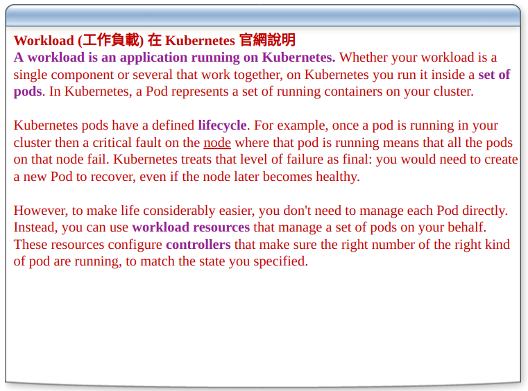
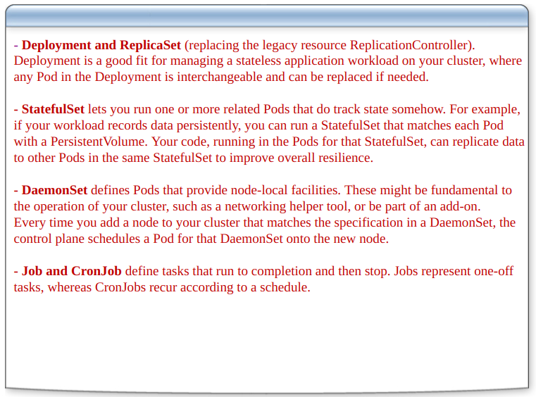
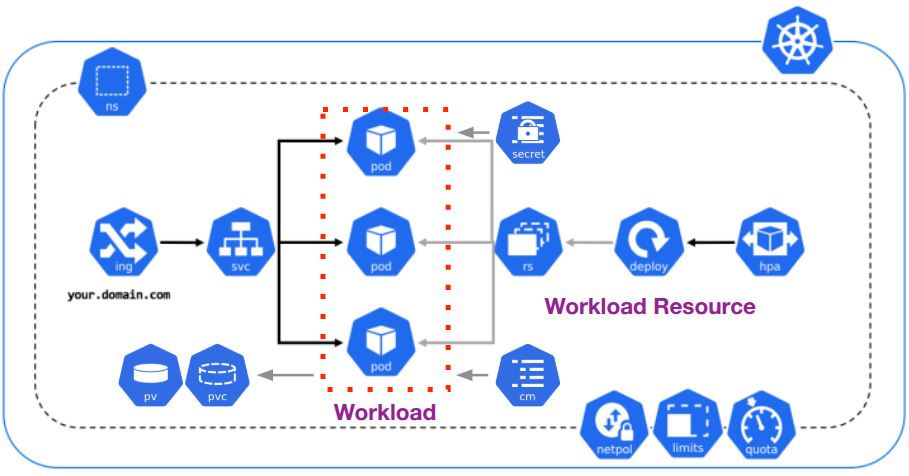
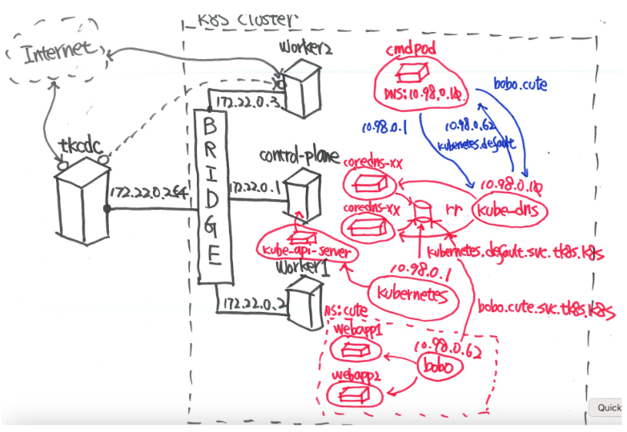
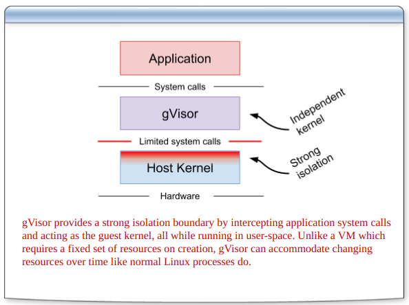
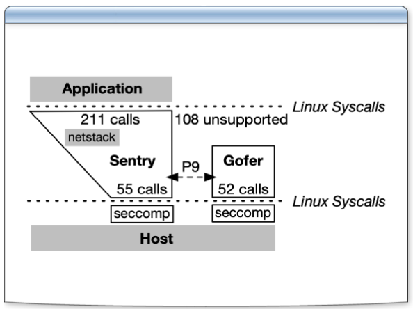
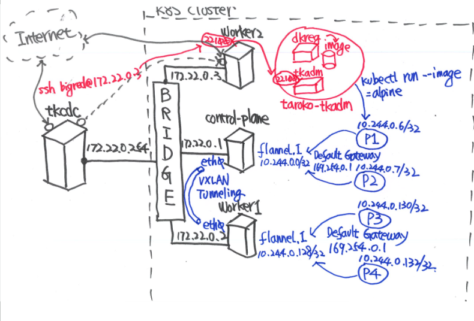
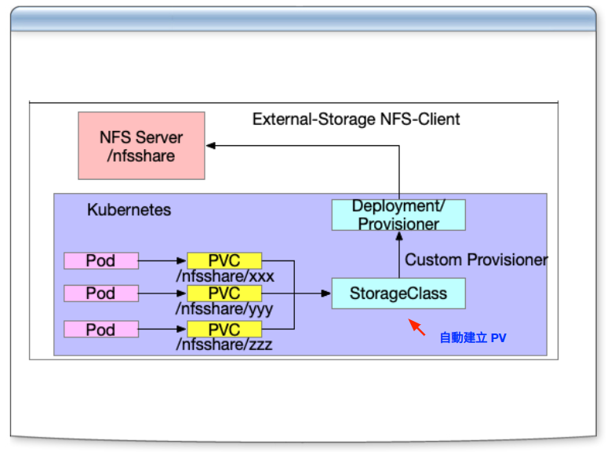

# 303-Taroko-K8S-Workload-3C

- [303投影片連結](https://docs.google.com/presentation/d/1auDBFNJ6KJeg1aYc8Vf_jRycZuM31MjX/edit?usp=drive_link&ouid=106614399658975385059&rtpof=true&sd=true)

## Kubernetes Workload


### 認識 Kubernetes Workload


- k8s企業的application
- application不只是單一pod
- 可以由多個不同的pod做出來
- 企業 application 不是 native pod
  - k8s禁止裸pod

### 認識 Kubernetes Workload Resources


- Workload產生，要透過Workload Resources
- `Workload Resource` 是 Control plane的`Controller-Manager`
- `四個重點`
  - Deployment and ReplicaSet
    - `Deployment`: application的進板/退板
    - `ReplicaSet`: auto scaling 橫向擴充 (本尊,分身)
      - 如果變0? => k8s 把 application `關機`
      - 跟刪掉差在，設定參數有保留
    - 戰略目標：常常久久，穩穩當當
    - 工作中用到的情況比較高

  - StatefulSet
    - 用於管理有狀態的應用（Stateful Applications）。
    - 支援與 `Persistent Volume（PV）`整合，確保數據持久化。
    - 適合需要多節點協作的應用（如資料庫、分散式系統）。
  - DaemonSet
    - 確保每個 Node 上都運行一個 Pod 副本。
    - **特性**：
      - 適合需要在所有 Node 上執行的應用（如監控代理、日誌收集器）。
      - 當有新 Node 加入叢集時，DaemonSet 會自動在該 Node 上部署 Pod。
    - **應用場景**：
      - 系統監控（如 Prometheus Node Exporter）。
      - 日誌收集（如 Fluentd、Filebeat）。
      - 網路代理（如 Cilium、Calico）。

  - Job and CronJob
    - **Job**:
      - 用於執行一次性任務，確保任務成功完成。
      - 支援重試機制，確保任務執行成功。
      - **應用場景**：
        - 資料處理任務。
        - 批次任務（如備份、數據遷移）。

    - **CronJob**:
      - 用於執行定時任務，類似於 Linux 的 `cron`。
      - 支援基於時間表的任務執行。
      - **應用場景**：
        - 定期備份。
        - 定時清理任務。
        - 定期報表生成。
      - 程式放在pod裡面跑，絕對不會Retry。

----- 

### K8S Workload 運作架構



- `deploy`: deployment
- `rs`: ReplicaSet
  - 確保指定數量的 Pod 副本在叢集中運行
- `hpa`: controller plan 的 sub-process
  - Horizontal Pod Autoscaler
  - 自動調整 Pod 的副本數量，根據資源使用情況進行橫向擴展
- `secret`: 存儲敏感數據, 帳號密碼憑證
- `cm`: ConfigMap, 存儲非敏感的配置資料
- `svc`: service
  - Kubernetes 中的網路抽象層，用於將流量從外部或內部路由到對應的 Pod。
  - 提供穩定的虛擬 IP（ClusterIP）或外部訪問方式（NodePort、LoadBalancer）。
  - service選pod, 表示有label selector
    - pod有對應的label
- `ing`: Ingress
  - 真正對外做連接的入口
  - 負責管理外部流量進入 Kubernetes 叢集。
  - 提供 HTTP/HTTPS 路由功能，將流量導向對應的 Service。
  - `reverse proxy nginx`: 改裝協助支援http以外的協定
  - `重要`: ingress將淘汰變成 `GatewayAPI`
- `PV`: Persistent Volume
  - 叢集中的存儲資源。
  - 來源:
    - K8S Volume
      - emptyDir, hostPath, Local
      - 雲端生態系通常會禁用，有資安疑慮
      - 最好弄清地端,雲端生態系的差異->原生
    - CSI標準提供儲存空間(上雲唯一選擇)
- `PVC`: Persistent Volume Claim
  - Pod 請求存儲資源的方式，用於數據持久化。
  - 寫在Pod裡面，要求PV
- `ns`: Namespace 辦公室
  - Kubernetes 中的邏輯隔離單位，用於組織和管理資源。
  - 每個 Workload 都運行在特定的 Namespace 中。
  - 三個在`namespace`下運作的要點
    - `Netpol`: network policy 網路策略，用於控制 Pod 之間的通信。(資安)
    - `Limits`: 資源限制，確保 Pod 不會超出指定的 CPU 和內存使用量。
    - `Quota`: 資源配額，用於限制 Namespace 中的資源使用。
      - 實務做法，壓數字等電話，抓錯就會接到改善電話。

-----

## Kubernetes Service Discovery

### kube-dns service & coredns deployment Controller

- 指令 `kubectl get all -n kube-system -l  k8s-app=kube-dns`
  - `-n`: namespace
  - `kube-system`: k8s的總管理處
  - `-l`: label
  - `k8s-app=kube-dns`: 標籤
    ```
    NAME                           READY   STATUS    RESTARTS        AGE
    pod/coredns-66967f4c59-sc4gn   1/1     Running   3 (6h44m ago)   46h
    pod/coredns-66967f4c59-zkpkl   1/1     Running   3 (6h44m ago)   46h

    NAME               TYPE        CLUSTER-IP   EXTERNAL-IP   PORT(S)                  AGE
    service/kube-dns   ClusterIP   10.98.0.10   <none>        53/UDP,53/TCP,9153/TCP   46h

    NAME                      READY   UP-TO-DATE   AVAILABLE   AGE
    deployment.apps/coredns   2/2     2            2           46h

    # 進板退板，會產生新的replicaset
    NAME                                 DESIRED   CURRENT   READY   AGE
    replicaset.apps/coredns-668d6bf9bc   0         0         0       46h
    replicaset.apps/coredns-66967f4c59   2         2         2       46h
    ```

  - 由上圖列出資源可看出
    - deployment coredns server
    - coredns產生兩個replicaset
    - repicaset產生兩個pod
    - 符合workload resources `deployment and replicaset`
  - k8s規劃service的ip尾碼一定是`10`
- 如何使用service/kube-dns？
  - `注意`: 只能在k8s內部其他workload使用，無法對外使用

- 指令 `kubectl get endpoints kube-dns -n kube-system`
  - 取得服務名稱 在 特定namespace底下
    ```
    NAME       ENDPOINTS                                                  AGE
    kube-dns   10.244.0.13:53,10.244.0.14:53,10.244.0.13:53 + 3 more...   47h
    ```
  - 檢查指令回傳，可以看到兩個IP位置，代表兩個pod
  - 注意`label`打錯會造成找不到服務endpoint，出錯比率很高 from 官網分享

-----

### kube-dns Service 名稱解析

- 指令 `kubectl run dnscmd --image=registry.k8s.io/e2e-test-images/agnhost:2.39`
  - google做的測試image, sre用的測試工具, 不只可以測dns
- 指令 `kubectl exec dnscmd -- cat /etc/resolv.conf`
  - 執行pod,傳入指令 印出 dns設定
    ```
    search default.svc.tk8s.k8s svc.tk8s.k8s tk8s.k8s dns.podman
    nameserver 10.98.0.10
    options ndots:5
    ```
  - `nameserver ip`只要是workload,pod都連到這個位置
  - 這個通常是印出原廠k8s規格設定 `這個位置不能改`，修改了會失聯
  - 錯誤作法：改`8.8.8.8`，絕對會出事

##### 補充resolv.conf

- from github copilot

```
search default.svc.tk8s.k8s svc.tk8s.k8s tk8s.k8s dns.podman
nameserver 10.98.0.10
options ndots:5
```

- Linux 系統中用於配置 DNS（域名系統）解析的文件，Kubernetes 中的 Pod 也會使用這個文件來進行域名解析。

1. `search` 字段
   - 作用：
     - 定義域名搜索後綴，用於簡化域名解析。
     - 當 Pod 嘗試解析一個短域名（如 my-service）時，系統會自動將這些後綴依次附加到短域名後進行解析。
   - 解釋：
     - default.svc.tk8s.k8s：
       - 表示當前 Pod 所在的 Namespace（default）中的 Service。
       - 如果 Pod 嘗試解析 my-service，實際會嘗試解析 my-service.default.svc.tk8s.k8s。
     - svc.tk8s.k8s：
       - 表示叢集中所有 Namespace 的 Service。
       - 如果 my-service.default.svc.tk8s.k8s 無法解析，會嘗試 my-service.svc.tk8s.k8s。
     - tk8s.k8s：
       - 表示叢集的根域名。
       - 如果前兩個後綴無法解析，會嘗試 my-service.tk8s.k8s。
     - dns.podman：
       - 額外的自定義域名後綴，可能用於特定的網路配置或測試環境。
2. nameserver 字段
   - 作用：
     - 定義 DNS 伺服器的 IP 地址，Pod 會將域名解析請求發送到這個地址。
   - 解釋：
     - nameserver 10.98.0.10：
       - 這是 Kubernetes 中的 kube-dns 或 CoreDNS Service 的 ClusterIP。
       - 所有 Pod 的域名解析請求都會發送到這個地址，由 kube-dns 或 CoreDNS 負責解析。
3. options ndots:5
   - 作用：
     - 定義域名中必須包含的點（.）數量，超過這個數量的域名會被認為是完全限定域名（FQDN，Fully Qualified Domain Name）。
     - 如果域名的點數少於 ndots 的值，系統會將 search 後綴依次附加進行解析。
   - 解釋：

     - ndots:5：
       - 如果域名中少於 5 個點（如 my-service），系統會將 search 後綴依次附加進行解析。
       - 如果域名中有 5 個或更多的點（如 my-service.default.svc.tk8s.k8s），系統會直接嘗試解析該域名。

###### 解析流程範例

假設 Pod 嘗試解析域名 my-service，解析流程如下：

1. 嘗試解析 my-service.default.svc.tk8s.k8s。
2. 如果失敗，嘗試解析 my-service.svc.tk8s.k8s。
3. 如果仍然失敗，嘗試解析 my-service.tk8s.k8s。
4. 如果所有嘗試都失敗，返回解析錯誤。

###### 注意事項

1. `nameserver` 的 IP 地址不能修改：
   - 這是 Kubernetes 內部的 DNS 伺服器地址，修改為其他地址（如 8.8.8.8）會導致 Pod 無法解析叢集內的服務域名。
   - 如果需要解析外部域名，kube-dns 或 CoreDNS 會自動將請求轉發到外部 DNS 伺服器。

2. `search` 後綴的順序：

   - Kubernetes 自動生成的 search 後綴順序是固定的，通常以 Pod 所在的 Namespace 為優先。
3. `ndots` 的影響：

   - 如果 ndots 設置過低，可能導致域名解析失敗，因為系統會直接嘗試解析短域名而不附加 search 後綴。

###### 總結

- `resolv.conf` 是 Kubernetes 中 Pod 的 DNS 配置文件，用於域名解析。
- `search` 定義了域名解析的後綴順序，`nameserver` 指定了 Kubernetes 的內部 DNS 伺服器，`options ndots:5` 控制了域名是否附加後綴進行解析。
- 正確配置和理解這些參數對於 Kubernetes 叢集內的服務通信至關重要。

-----

### kube-dns Service 運作架構



- 為何coredns會有兩個pod塞在control plane
- zone database: 存record
- etcd : 在control plane
  - 故coredns就近放這
- 兩個pod做load balance

- 指令 `kubectl pods -n kube-system -o wide`
  - 查詢coredns所在位置
  ```
  NAME                                         READY   STATUS    RESTARTS       AGE     IP             NODE                 NOMINATED NODE   READINESS GATES
  calico-kube-controllers-6b65fb5f89-66t62     1/1     Running   5 (42m ago)    2d16h   10.244.0.19    tk8s-control-plane   <none>           <none>
  canal-9dc5v                                  2/2     Running   10 (42m ago)   2d16h   172.22.0.2     tk8s-worker1         <none>           <none>
  canal-ql5xj                                  2/2     Running   10 (42m ago)   2d16h   172.22.0.3     tk8s-worker2         <none>           <none>
  canal-rv6n7                                  2/2     Running   10 (42m ago)   2d16h   172.22.0.1     tk8s-control-plane   <none>           <none>
  coredns-66967f4c59-sc4gn                     1/1     Running   5 (42m ago)    2d16h   10.244.0.20    tk8s-control-plane   <none>           <none>
  coredns-66967f4c59-zkpkl                     1/1     Running   5 (42m ago)    2d16h   10.244.0.21    tk8s-control-plane   <none>           <none>
  etcd-tk8s-control-plane                      1/1     Running   5 (42m ago)    2d16h   172.22.0.1     tk8s-control-plane   <none>           <none>
  kube-apiserver-tk8s-control-plane            1/1     Running   5 (42m ago)    2d16h   172.22.0.1     tk8s-control-plane   <none>           <none>
  kube-controller-manager-tk8s-control-plane   1/1     Running   5 (42m ago)    2d16h   172.22.0.1     tk8s-control-plane   <none>           <none>
  kube-proxy-4g4b7                             1/1     Running   5 (42m ago)    2d16h   172.22.0.3     tk8s-worker2         <none>           <none>
  kube-proxy-lstnd                             1/1     Running   5 (42m ago)    2d16h   172.22.0.2     tk8s-worker1         <none>           <none>
  kube-proxy-tpn5w                             1/1     Running   8 (42m ago)    2d16h   172.22.0.1     tk8s-control-plane   <none>           <none>
  kube-scheduler-tk8s-control-plane            1/1     Running   5 (42m ago)    2d16h   172.22.0.1     tk8s-control-plane   <none>           <none>
  metrics-server-8467fcc7b7-d9x4b              1/1     Running   10 (42m ago)   2d16h   10.244.0.146   tk8s-worker1         <none>           <none>
  ```
  - 原生coredns在control plane
    - 這個版本k8s是在產生時刪除pod，replicaset會在worker上面產生新的pod。

#### kube proxy

- k8s service會透過kube proxy協助運作
- 有三種模式 iptables, nftables, ipvs

##### iptables (預設)

- 會發生iptables storm，當service數量超過`1000`，明顯運作效能下降
  - 查詢沒有index概念,只有`table scan`
- 情境: microservice
- 1.30版，出現`nftalbes`
  - netfilter，比iptables快100倍

##### nftable

- nftables 是 Linux 系統中的一個框架，用於替代傳統的 iptables，負責網路封包過濾和流量控制。它是 Netfilter 子系統的一部分，從 Linux Kernel 3.13 開始引入，並逐漸成為 iptables 的現代化替代方案。

- 缺點ip random

###### nftables 在 Kubernetes 中的應用

1. 解決 iptables storm 問題：

   - 當 Kubernetes 中的 Service 數量超過 1000 時，iptables 的性能會明顯下降，因為它需要逐條掃描規則。
   - nftables 使用高效的查詢結構，能夠快速匹配規則，避免性能瓶頸。

2. 提升微服務架構的網路性能：

   - 在微服務架構中，Service 和 Pod 的數量通常較多，nftables 能夠更高效地處理大量的網路規則。

3. 未來的 Kubernetes 網路解決方案：

   - 隨著 Linux Kernel 的發展，nftables 已經成為 iptables 的現代化替代方案，未來可能會成為 Kubernetes 的默認網路過濾框架。


##### ipvs

- IPVS 在 Kubernetes CoreDNS 的用途
  - IPVS（IP Virtual Server） 是 Linux Kernel 中的一個高效能負載均衡框架，主要用於處理網路流量的分發。在 Kubernetes 中，IPVS 是 kube-proxy 的一種運行模式，負責高效地處理 Service 的流量轉發。


##### Kube Proxy 三種模式差異

| **模式**       | **描述**                                                                 | **優點**                                                                 | **缺點**                                                                 |
|----------------|-------------------------------------------------------------------------|--------------------------------------------------------------------------|--------------------------------------------------------------------------|
| **iptables**   | 傳統的網路封包過濾框架，使用線性規則掃描來處理流量轉發。                  | - Kubernetes 預設模式，成熟穩定。<br>- 易於理解和配置。                   | - 當 Service 規模超過 1000 時，性能明顯下降（iptables storm）。<br>- 查詢沒有索引概念，需逐條掃描規則（table scan）。 |
| **nftables**   | iptables 的現代化替代方案，使用高效的查詢結構來處理流量轉發。              | - 性能更高，適合大量規則。<br>- 語法簡潔一致，易於管理。<br>- 支援更靈活的匹配條件。 | - 目前在 Kubernetes 中的應用較少，生態系統尚未完全成熟。<br>- 可能存在 IP 隨機性問題（ip random）。 |
| **ipvs**       | 基於 Linux Kernel 的高效能負載均衡框架，使用哈希表進行規則匹配。           | - 性能最佳，適合大規模微服務架構。<br>- 支援多種負載均衡算法（如輪詢、最小連接）。<br>- 提供高可用性和快速故障轉移。 | - 配置相對複雜，學習成本較高。<br>- 需要 Kernel 支援，對舊版本的 Linux 可能不兼容。 |

-----

#### kubernates service

- 參考運作架構圖
- service 一定會註冊到 coredns
  - 對外的運作名稱
  - `kubernates.default.svc.tk8s.k8s`
    - `<service-name>.<namespace>.svc.<cluster-domain>`
    - `default`: namespace
    - `svc`: service record
      - 固定值，表示這是一個 Kubernetes 的 Service。
      - 用於區分其他類型的資源（如 Pod、ConfigMap 等）。
    - `tk8s.k8s`: cluster-domain
      - 表示叢集的域名，通常由叢集的 DNS 配置決定。
      - 在這個例子中，tk8s.k8s 是叢集的域名。

##### bobo service

- 參考運作架構圖
- bobo.cute.svc.tk8s.k8s
- 注意命名，外面有的命名，內部命名不能衝突，不然會連不到

#### k8s namespace設定 `操作`

- 指令 `dir /opt/zfs/tk8s`
- 指令 `docker ps -a`
  ```
  CONTAINER ID  IMAGE                               COMMAND     CREATED     STATUS      PORTS       NAMES
  857bbe4422c0  quay.io/cloudwalker/taroko:v1.32.2  bash        2 days ago  Up 2 hours              tk8s-control-plane
  8504cc6d6722  quay.io/cloudwalker/taroko:v1.32.2  bash        2 days ago  Up 2 hours              tk8s-worker1
  6b1fdced9b95  quay.io/cloudwalker/taroko:v1.32.2  bash        2 days ago  Up 2 hours              tk8s-worker2
  ```
- 指令 `docker exec -it tk8s-control-plane bash`

- 進入control-plane主機,找設定檔
- 指令 `ls -al /opt/zfs`
```
drwxrwxrwx 7 root root 4096 Apr 24 00:42 .
drwxr-xr-x 1 root root 4096 Apr 21 08:53 ..
-rw------- 1 1000 1000 5630 Apr 21 08:53 config
-rw-r--r-- 1 root root  764 Apr 21 08:53 containerd-config.yaml
drwxr-xr-x 2 root root 4096 Apr 21 08:57 dkreg
drwxr-xr-x 3 root root 4096 Apr 23 05:47 goweb
-rw-r--r-- 1 root root   70 Apr 24 00:42 hosts
-rw-r--r-- 1 root root 1599 Apr 21 08:53 init-config.yaml
-rw-rw-r-- 1 1000 1000  393 Apr 24 00:42 net.info
drwxr-xr-x 2 root root 4096 Apr 21 08:57 podman
drwxrwxrwx 2 root root 4096 Apr 21 08:57 storage
-rwxr-xr-x 1 root root  102 Apr 24 00:42 tkadd-dnat.sh
-rwxr-xr-x 1 root root  102 Apr 24 00:42 tkdel-dnat.sh
-rwxr-xr-x 1 root root  102 Apr 24 00:30 tkdel-dnat.sh.old
drwxr-xr-x 3 1000 1000 4096 Apr 21 08:58 wulin
```

- 指令 `cat /opt/zfs/init-config.yaml`
  ```yaml
  apiVersion: kubeadm.k8s.io/v1beta4
  kind: InitConfiguration
  localAPIEndpoint:
    advertiseAddress: 172.22.0.1                   # change from Master node IP
    bindPort: 6443
  nodeRegistration:
    #!! 使用CRI containerd !!#
    criSocket: unix:///run/containerd/containerd.sock         # change from CRI-O Unix Socket
    imagePullPolicy: IfNotPresent
    name: tk8s-control-plane                                      # change from Master node hsotname
    taints: null
  ---
  apiServer: {}
  apiVersion: kubeadm.k8s.io/v1beta4
  certificatesDir: /etc/kubernetes/pki
  #!! 叢集名稱，多叢集要不一樣 !!#
  clusterName: tk8s                             # set your clusterName
  controllerManager:
    extraArgs:
      - name: node-cidr-mask-size              # set pod cidr per node
        value: "25"
  dns: {}
  etcd:
    local:
      dataDir: /var/lib/etcd
  imageRepository: registry.k8s.io
  kind: ClusterConfiguration
  #!! 版本代號 > 1.30 以上 !!#
  kubernetesVersion: 1.32.2
  networking:
    #!! domain name !!#
    dnsDomain: tk8s.k8s                                    # DNS domain used by Kubernetes Services.
    podSubnet: 10.244.0.0/21                             # the subnet used by Pods.
    serviceSubnet: 10.98.0.0/24                           # subnet used by Kubernetes Services.
  scheduler: {}
  ---
  apiVersion: kubeproxy.config.k8s.io/v1alpha1
  kind: KubeProxyConfiguration
  #!! 選用dns模式 !!#
  mode: nftables
  ---
  apiVersion: kubelet.config.k8s.io/v1beta1
  kind: KubeletConfiguration
  #!! 官網預設110(跟IP配置數量有關)，主機不強要降低 !!#
  maxPods: 80
  # podLogsDir: /opt/zfs/logs
  #!! 限制避免爆單 !!#
  containerLogMaxFiles: 3    
  containerLogMaxSize: 1Mi   
  #evictionHard:
  #  memory.available: "1024Mi"
  #  nodefs.available: "10%"
  #kubeReserved:
  #  cpu: "500m"
  #  memory: "1Gi"
  #systemReserved:
  #  cpu: "1"
  #  memory: "1Gi"
  #  ephemeral-storage: "10Gi"
  ```

- tk8s流程 
  - 先產生container
  - 外部主機cp設定檔
  - kubeadm 建立 傳入設定檔

- 自建k8s權限設定是最廣的
- 雲端是已經設定好了，部份規格鎖死


#### tk/bin原始碼解析(補充)
- 自建k8s命令，參考講師使用shell腳本建立流程

- 建立container指令`kcn`
- 指令 `cat tk/bin/kcn`
  ```shell
    sudo podman run -itd \
      --name ${ctn} \
      --hostname ${ctn} \
      --cpus ${cc} \
      --memory ${cm} \
      --privileged \
      --net ${cn} \
      # 指定IP
      --ip ${cip} \
      --volume ${HDIR}/cni:/opt/cni/bin \
      --volume /lib/modules:/lib/modules:ro \
      --volume ${controlVolume}:/var:suid,exec,dev,rbind \
      --volume /opt/zfs/${cn}:/opt/zfs \
      # 掛到container內，pod可以使用的dockerfile
      --volume ${HDIR}/tk/wulin:/opt/wulin \
      --cgroupns=private \
      $IMG bash &>/dev/null
  ```
- `control group`: app container才有
  - vm啟動比k8s快
  - 但執行k8s比vm快
  - 因為有control group負責相關工作分配
  - control group
    - `1.24`: v1
    - `1.30`: v2
    - 效能v2比v1好
  - jdk 8 內建會去咬 control group v1
    - 導致k8s要被退板到1.30以下
  - 要跟客戶確認是否有遺產系統存在

- 建立k8s `kto`
- 指令 `cat tk/bin/kto`
  - k8s設定檔, 讀取configmap
    ```shell
    [ ! -f ~/tk/conf/${cn}.conf ] && echo "~/tk/conf/${cn}.conf not found" && exit 1
    source ~/tk/conf/${cn}.conf
    ```
  - 設定進container
    ```shell
    cat ~/tk/bin/init-config-now.yaml | envsubst | sudo tee /opt/zfs/${cn}/init-config.yaml &>/dev/null
    ```
  - app container kubeadm 做出 control plane
    ```shell
    sudo podman exec -it ${cn}-control-plane bash -c "kubeadm init --config=/opt/zfs/init-config.yaml --ignore-preflight-errors=SystemVerification"
    ```
  - kubeproxy
    ```
    kubectl get configmap kube-proxy -n kube-system -o yaml 2>/dev/null | \
          sed 's/maxPerCore: null/maxPerCore: 0/g' | kubectl apply -f - &>/dev/null
    ```
  - work1
    ```
    sudo podman exec -it ${cn}-worker1 bash -c "$join $ignore" &>/tmp/${cn}-worker1.out
    ```
  - work2
    ```
    sudo podman exec -it ${cn}-worker2 bash -c "$join $ignore" &>/tmp/${cn}-worker2.out
    ```

-----

## Container Runtime Interface (CRI)

- 建立app container的標準
- `runc`: 執行程式(go語言寫的)
  - 執行命令不只有runc這個命令
- `crun`: 用c語言寫的執行程式(加速器)
- 程式已經cp進node主機
  - 但需要告知關聯

### K8S Runtime Class

- 檢查檔案內容
- 指令 `dir /opt/zfs/tk8s`
- 讀取containerd-config.yaml給containerd
- 指令 `cat /opt/zfs/tk8s/containerd-config.yaml`
  - 糾正副檔名 `toml`
  ```toml
  [plugins."io.containerd.grpc.v1.cri".registry.mirrors."dkreg.taroko:5000"]
    endpoint = ["http://dkreg.taroko:5000"]
  [plugins."io.containerd.grpc.v1.cri".registry.configs."dkreg.taroko:5000".tls]
    insecure_skip_verify = true
  # crun要trace的位置
  [plugins."io.containerd.grpc.v1.cri".containerd.runtimes.crun]
    base_runtime_spec = "/etc/containerd/cri-base.json"
    runtime_type = "io.containerd.runc.v2"
    [plugins."io.containerd.grpc.v1.cri".containerd.runtimes.crun.options]
      BinaryName = "/usr/bin/crun"
  # app container共用kernel，sc有獨立的kernel
  [plugins."io.containerd.grpc.v1.cri".containerd.runtimes.runsc]
    base_runtime_spec = "/etc/containerd/cri-base.json"
    runtime_type = "io.containerd.runsc.v1"
  [plugins."io.containerd.grpc.v1.cri".containerd.runtimes.runsc.options]
      BinaryName = "/usr/local/bin/runsc"
  ```
  - crun在每個node的`/usr/bin/crun'
  - 專案kata把pod變成真正的vm
    - `KubeVirt` => Virtual machine
    - 表示k8s管理pod的工具，將來有機會管理VM
  - `Harvester`: datacenter 系統
    - `參考連結` https://github.com/harvester/harvester
    - 建議裸機安裝，內建k8s，KubeVirt
    - 專供virtual machine，可以頂替VM Ware
    - 效能弱於VM Ware

###### runc與runsc差異

|名稱|描述|
|-----|-----|
|runc|傳統的容器運行時，基於 Linux Namespace 和 cgroups，提供輕量級的容器化運行環境。|
|runsc|基於 Google 的 gVisor 技術，提供沙盒化的容器運行時，強調安全隔離。|


#### 建立與使用 crun Runtime Class

- 指令 `cat ~/tk/wulin/yaml/rc-crun.yaml`
  ```yaml
  apiVersion: node.k8s.io/v1
  kind: RuntimeClass
  # 告訴k8s有crun
  metadata:
    name: crun
  handler: crun 
  ```
- 指令 `kubectl apply -f  ~/tk/wulin/yaml/rc-crun.yaml`
  ```
  runtimeclass.node.k8s.io/crun created
  ```

- 指令 `cat ~/tk/wulin/yaml/pod-crun.yaml`
  ```yaml
  apiVersion: v1
  kind: Pod
  metadata:
    name: pod-crun
  spec:
    # 可以設定選用的runtimeClassName,彈性調整
    runtimeClassName: crun
    containers:
    - name: base
      image: quay.io/cloudwalker/alp.base
      securityContext:
        privileged: true
  ```

- 指令 `kubectl apply -f ~/tk/wulin/yaml/pod-crun.yaml`
  ```
  pod/pod-crun created
  ```

- 指令 `kubectl get pods -o wide`
  ```
  NAME       READY   STATUS    RESTARTS       AGE   IP             NODE           NOMINATED NODE   READINESS GATES
  dnscmd     1/1     Running   2 (3h3m ago)   19h   10.244.0.148   tk8s-worker1   <none>           <none>
  goweb      1/1     Running   2 (3h3m ago)   21h   10.244.0.147   tk8s-worker1   <none>           <none>
  pod-crun   1/1     Running   0              14s   10.244.0.149   tk8s-worker1   <none>           <none>
  ```

### 認識gVisor


- Application 包含相依檔 image內容
- gVisor google創造虛擬kernel hyper visor


- gVisor架構
- `Sentry`: 負責 211 個系統呼叫, 不是全部系統呼叫, 所以不是所有應用系統都能在 gVisor 架構中執行
- `Gofer`: 負責檔案系統

------

## Container Network Interface (CNI)

- 花錢買軟體上雲，要想辦法知道底層術語，與雲端商溝通，對於專案才能有效維運。

- `Flannel` 致命傷，無法提供network policy(防火牆)
- CNI一定要support network policy
  - 避免客戶裝flannel，理由如上
- Demo使用的的CNI, `Canal` 是 Calico的分支
- 證照推薦`CCNA`，才有辦法handle k8s網路

### Canal運作架構



- Canal 是一個 Kubernetes 網路插件，結合了 Flannel 和 Calico 的功能，提供簡單易用的網路連接（Flannel）和強大的網路策略管理（Calico）。它是一個混合型解決方案，適合需要基本網路功能和網路安全策略的 Kubernetes 叢集。

- 虛擬橋接網路丟資料

- workerNode flanal.1 透過daemon程式傳遞資料
  - 讀`etcd`資料庫
    - network policy rule

- node之間
  - `etcd` -> routing table表
  - 傳遞加密封包

- `Multus CNI`
  - Multus CNI 是 Kubernetes 的一個 CNI 插件，用於實現多網卡（多網路接口）的支持。它允許 Pod 同時連接到多個網路，從而滿足複雜網路需求，例如多租戶環境、網路隔離、高性能網路等。
  - 上雲的環境，Redhat Openshift有的功能，雲端也要具備。
  - 虛擬橋接器，不透過daemon，速度會比較快
  - Multus 除了Pod之間，也能在不同Node之間建立通道。

- 指令 `kubectl get all -n kube-system -o wide -l k8s-app=canal`
  ```
  NAME              READY   STATUS    RESTARTS         AGE     IP           NODE                 NOMINATED NODE   READINESS GATES
  pod/canal-9dc5v   2/2     Running   10 (5h12m ago)   2d20h   172.22.0.2   tk8s-worker1         <none>           <none>
  pod/canal-ql5xj   2/2     Running   10 (5h12m ago)   2d20h   172.22.0.3   tk8s-worker2         <none>           <none>
  pod/canal-rv6n7   2/2     Running   10 (5h12m ago)   2d20h   172.22.0.1   tk8s-control-plane   <none>           <none>

  NAME                   DESIRED   CURRENT   READY   UP-TO-DATE   AVAILABLE   NODE SELECTOR            AGE     CONTAINERS                 IMAGES                                                                 SELECTOR
  daemonset.apps/canal   3         3         3       3            3           kubernetes.io/os=linux   2d20h   calico-node,kube-flannel   quay.io/cloudwalker/node:v3.29.2,quay.io/cloudwalker/flannel:v0.24.4   k8s-app=canal
  ```
  - `daemonSet`: 在每一個node安排一個pod
    - 執行daemon程式(負責監控的設計)
  - 問題 `Prometheus` 的監控方式最早在每個pod side car監控
    - 有效能問題，後面拉到Node來做

- 指令 `kubectl get pod/canal-9dc5v -o json -n kube-system | grep -A 1 '"command":' | tr -d ' ' | grep /opt/bin/flanneld`
  ```
  "/opt/bin/flanneld",
  ```

-----

## kube-proxy daemonset

- 原生ipvs要突破內外網路的問題
- 選用雲端商 ipvs 內外網路要順暢
  - 花錢買服務

### kube-proxy 如何做出

- 指令 `kubectl get all -n kube-system -o wide -l k8s-app=kube-proxy`
- kube-proxy是一個程式來維護iptables
- vitural ip 是 iptables做出來的
  - 由kube-proxy產生
- 是一個daemonset嵌入在k8s node裡面
  - 才能維護相同的iptables
- daemonset要讀 `etcd`
  - daemonset controller產生`pod`

- 指令 `sudo podman exec tk8s-worker2 curl -s localhost:10249/proxyMode; echo`
  - 確認kube-proxy的proxyMode
  ```
  nftables
  ```

------

## Container Storage Interface (CSI)

- 第三方儲存設備

- `官方的CSI` https://github.com/kubernetes-csi
  - csi-driver-nfs : linux
  - csi-driver-smb : ms file server
  - csi-driver-host-path 
    - 透過此csi運用某個node上的hostPath
    - 會有實戰流程
    - 注意: 有血淚經驗


### Dynamic Volume Provision



- pod 裡面要宣告一組 `pvc` yaml檔
  - 使用空間大小
  - 存取模式(Read/Write/RW)

- StorageClass
  - 一個interface，透過它run背後的程式
  - 參考`RuntimeClass`，有不同的實作方式

- Deployment/`Provisioner` : 負責產生 `pv`
  - 通知nfs file system要求儲存需求
  - 找到persistance volume
  - `bound`(捆綁,領証) `pvc`與`pv`
    - 把`pvc`刪掉時，`pv`就不能再跟其他pvc bound
    - 物件產生`uuid`
    - 實務作法`pv`,`pvc`要一起刪掉

- 由`Provisioner`建立`pv`
  - 所以只要建立`pvc`
  - 透過`CSI`會協助維運`pv`

- 問題 `Provisioner` 程式誰提供
  - 雲端商/地端商業軟體
    - 使用的程式都不相同
  - driver會去哪邊找空間？
    - ex: AWS會想到S3


- 指令 `kubectl get all -n local-path-storage`
  ```
  NAME                                          READY   STATUS    RESTARTS        AGE
  pod/local-path-provisioner-84944977bd-fpmmz   1/1     Running   7 (6h11m ago)   2d21h

  NAME                                     READY   UP-TO-DATE   AVAILABLE   AGE
  deployment.apps/local-path-provisioner   1/1     1            1           2d21h

  NAME                                                DESIRED   CURRENT   READY   AGE
  replicaset.apps/local-path-provisioner-84944977bd   1         1         1       2d21h
  ```
  - 這套csi使用 `deployment/replicaset` workload建立
- 大部分csi是用`deployment` controller建立驅動程式的pod
  - 問題：CSI版本舊，是否能進版
    - depolyment負責可以
  - 問題：Node是否有容錯
    - replicaset會重建pod

- 實驗刪除pod

- 指令 `kubectl delete pod/local-path-provisioner-84944977bd-fpmmz -n local-path-storage`
  ```
  pod "local-path-provisioner-84944977bd-fpmmz" deleted
  ```
- 重新執行get all 發現 replicaset已產生新的pod


### 建立 PersistentVolumeClaim

- 指令 `kubectl get sc`
  - `sc` : StorageClass
  - 要把名稱寫在PVC裡面
  ```
  NAME         PROVISIONER             RECLAIMPOLICY   VOLUMEBINDINGMODE      ALLOWVOLUMEEXPANSION   AGE
  local-path   rancher.io/local-path   Delete          WaitForFirstConsumer   false                  2d22h
  ```

- 指令 `cat ~/tk/wulin/yaml/pvc-nginx.yaml`
  - yaml先看kind
  ```yaml
  apiVersion: v1
  kind: PersistentVolumeClaim
  metadata:
    name: nginx-storage
    annotations:
      volumeType: hostPath     # volumeType: <local or hostPath>
  spec:
    storageClassName: local-path
    accessModes:
      # 控管限制由CSI驅動程式決定
      - ReadWriteOnce
    resources:
      requests:
        storage: 3Mi
  ```
  - 存取模式由csi決定
    - 當csi驅動程式沒有特別對accessMode作用時，會沒有作用
    - 因此要看實作廠商的技術文件，千萬不能亂寫

- 每個供應商，都有各自擅長的storage，因此轉換到別的雲或者商品時，因為各自的特點不同，會遇到migration的痛點。
