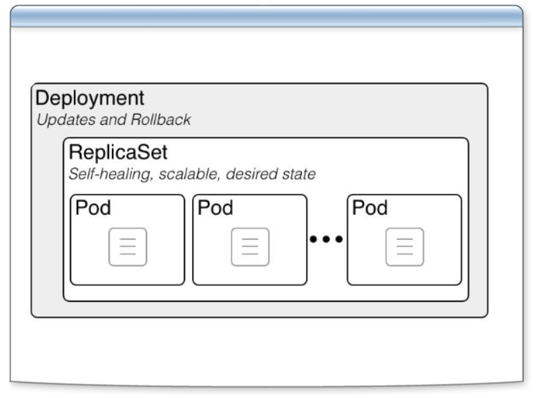
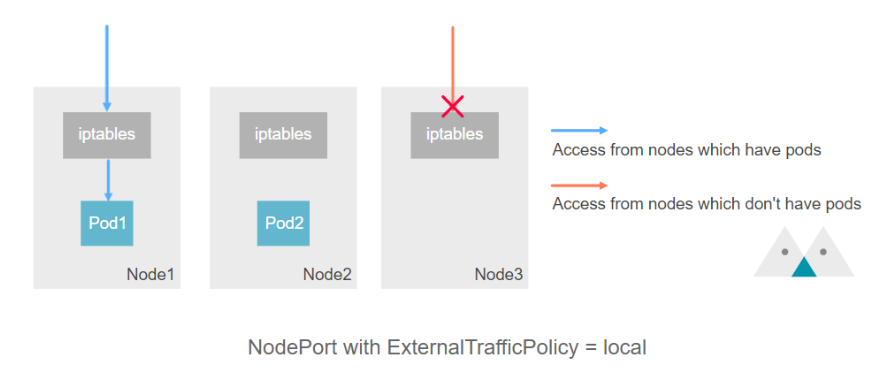

# 306-K8S-Deployment-Kustomize

## Deployment Controller




- 指令 `ssh bigred@tk8s -p 22100`
  - 登入真正的管理機器
- 指令 `ps aux`
    ```
    USER         PID %CPU %MEM    VSZ   RSS TTY      STAT START   TIME COMMAND
    root           1  0.0  0.0   1736   896 pts/0    Ss+  08:39   0:00 /bin/ash
    root          22  0.0  0.0   6132  2832 ?        S    08:39   0:00 sshd: /u
    root          24  0.0  0.0   6668  4352 ?        Ss   15:33   0:00 sshd-ses
    bigred        26  0.0  0.0   6960  3776 ?        S    15:33   0:00 sshd-ses
    bigred        27  0.0  0.0   1716  1152 pts/1    Ss   15:33   0:00 -ash
    root          29  0.0  0.0      0     0 ?        Zs   15:33   0:00 [sudo] <
    root          56  0.0  0.0      0     0 ?        Zs   15:33   0:00 [sudo] <
    root          59  0.0  0.0      0     0 ?        Zs   15:33   0:00 [sudo] <
    root          62  0.0  0.0      0     0 ?        Zs   15:33   0:00 [sudo] <
    bigred        65  0.0  0.0   2524  1664 pts/1    R+   15:34   0:00 ps aux
    ```
    - PID 1 是pod
      - 裡面是`xwindow`，有圖形化界面

- 指令 `kubectl create deploy d3 --image=quay.io/cloudwalker/alpine.derby --dry-run=client -o yaml > d3.yaml`
  - 製作yaml檔: `d3.yaml`
    ```yaml
    apiVersion: apps/v1
    kind: Deployment
    metadata:
    creationTimestamp: null
    labels:
        app: d3
    name: d3
    spec:
    # 只建立一個pod
    replicas: 1
    selector:
        matchLabels:
        app: d3
    strategy: {}
    # pod的宣告,不用指名,依賴replicaset
    template:
        metadata:
        creationTimestamp: null
        labels:
            app: d3
        spec:
        containers:
        - image: quay.io/cloudwalker/alpine.derby
            name: alpine-derby-crc2f
            resources: {}
    status: {}
    ```
- 指令 `kubectl apply -f d3.yaml`
    ```
    deployment.apps/d3 created
    ```
- 指令 `kubectl get all -o wide`
  - 確認d3 pod所在的node
```
NAME                      READY   STATUS    RESTARTS       AGE    IP             NODE           NOMINATED NODE   READINESS GATES
pod/d3-66f4b56bd5-cvq8z   1/1     Running   0              101s   10.244.1.20    tk8s-worker2   <none>           <none>
pod/dnscmd                1/1     Running   2 (7h8m ago)   23h    10.244.0.148   tk8s-worker1   <none>           <none>
pod/goweb                 1/1     Running   2 (7h8m ago)   25h    10.244.0.147   tk8s-worker1   <none>           <none>
pod/pod-crun              1/1     Running   0              4h4m   10.244.0.149   tk8s-worker1   <none>           <none>

NAME                 TYPE        CLUSTER-IP   EXTERNAL-IP   PORT(S)   AGE     SELECTOR
service/kubernetes   ClusterIP   10.98.0.1    <none>        443/TCP   2d22h   <none>

NAME                 READY   UP-TO-DATE   AVAILABLE   AGE    CONTAINERS           IMAGES                             SELECTOR
deployment.apps/d3   1/1     1            1           101s   alpine-derby-crc2f   quay.io/cloudwalker/alpine.derby   app=d3

NAME                            DESIRED   CURRENT   READY   AGE    CONTAINERS           IMAGES                             SELECTOR
replicaset.apps/d3-66f4b56bd5   1         1         1       101s   alpine-derby-crc2f   quay.io/cloudwalker/alpine.derby   app=d3,pod-template-hash=66f4b56bd5
```

- 指令 `kubectl cordon tk8s-worker2`
  - `cordon`: 拉警戒線，不能在產生pod
  - 同時要處理pv問題，切換工作區也要能帶過去
  ```
  node/tk8s-worker2 cordoned
  ```

- 指令 `kubectl delete pod/d3-66f4b56bd5-cvq8z`
  - 刪除pod d3
  - pod是否會復活？會產生在哪個位置？
    - 預期: 會, 產生在work1
  ```
  pod "d3-66f4b56bd5-cvq8z" deleted
  ```
  ```
    NAME                  READY   STATUS    RESTARTS        AGE     IP             NODE           NOMINATED NODE   READINESS GATES
    d3-66f4b56bd5-6wht8   1/1     Running   0               70s     10.244.0.150   tk8s-worker1   <none>           <none>
    dnscmd                1/1     Running   2 (7h13m ago)   23h     10.244.0.148   tk8s-worker1   <none>           <none>
    goweb                 1/1     Running   2 (7h13m ago)   26h     10.244.0.147   tk8s-worker1   <none>           <none>
    pod-crun              1/1     Running   0               4h10m   10.244.0.149   tk8s-worker1   <none>           <none>
  ```

- 指令 `kubectl uncordon tk8s-worker2`
  - 解除封鎖線

- `小結`
  - 注意deployment設定，也要確認PV
    - 如果移動workNode時，資料也要帶過去。
    - 不然資料掉了很恐怖

- 指令 `kubectl scale deploy d3 --replicas=0`
  - 關機
- 指令 `kubectl scale deploy d3 --replicas=2`
  - 重啟
  - 確認發現 worker 1, 2 都有
- 指令 `kubectl scale deploy d3 --replicas=6`
  - 確認worker 1, 2 / control-plane的pod分配
- 指令 `kubectl scale deploy d3 --replicas=3`
  - 確認worker 1, 2 / control-plane的pod分配

- `小結`
  - 部屬依據node每一台逐步循環

-----

## NodePort Service with TrafficPolicy



- 如何把deployment的pod能夠對外溝通
  - `NodePort Service`
- 會打有Pod的Node
  - NodePort的default是每一個Node都打開一個port
    - 沒有Pod也開(`CKA考題:要求沒Pod不能開`)
  - 此功能不能用ipvs

### 建立  dep-goweb deployment

- 指令 `kubectl apply -f ~/wulin/yaml/dep-goweb.yaml`
    ```
    deployment.apps/dep-goweb created
    ```

- 指令 `kubectl get all -o wide`
  - 會產生兩個pod

- 指令
    ```shell
    echo 'kind: Service
    apiVersion: v1
    metadata:
    name: svc-goweb
    spec:
    type: NodePort
    # 設定成Local->有pod的Node才會開NodePort, 沒設定會時快時慢
    externalTrafficPolicy: Local
    selector:
        app: dep-goweb
    ports:
    - protocol: TCP
        nodePort: 30080
        port: 8080
        targetPort: 8080' > ~/wulin/yaml/svc-goweb.yaml 
    ```
    - externalTrafficPolicy設定Local
    - nodePort: 30080
      - k8s規定只能開 range 30000~32000
- 指令 `kubectl create -f ~/wulin/yaml/svc-goweb.yaml`
  - 會產生兩個pod

- 退出tkadm
- 指令
    ```
    # 沒有回應, 是control-plane
    curl http://172.22.0.1:30080

    -----------------------------

    curl -I http://172.22.0.2:30080
        HTTP/1.1 200 OK
        Accept-Ranges: bytes
        Content-Length: 121
        Content-Type: text/html; charset=utf-8
        Last-Modified: Wed, 23 Apr 2025 05:47:10 GMT
        Date: Thu, 24 Apr 2025 08:18:54 GMT

    -----------------------------

    curl -I http://172.22.0.3:30080
        HTTP/1.1 200 OK
        Accept-Ranges: bytes
        Content-Length: 121
        Content-Type: text/html; charset=utf-8
        Last-Modified: Wed, 23 Apr 2025 05:47:10 GMT
        Date: Thu, 24 Apr 2025 08:19:14 GMT

    ```